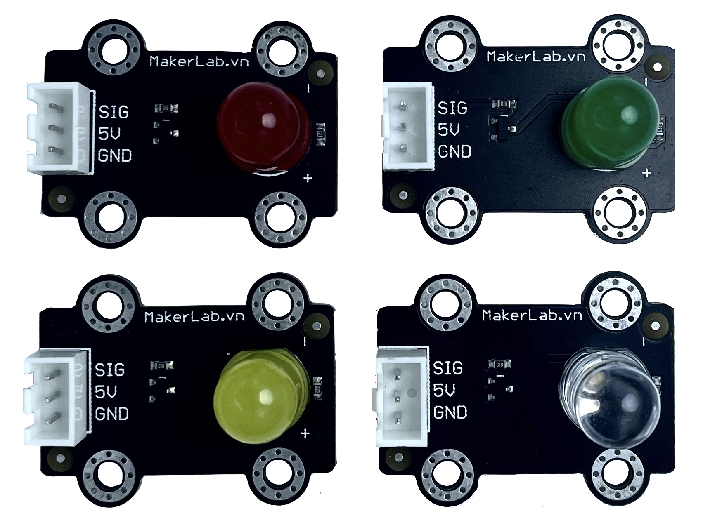

<!DOCTYPE html>
<html>
<div style="display: flex; align-items: center; justify-content: space-between;">
  <div style="flex: 1;">
    <p><strong>Mạch LED đơn MKE-M01</strong> là module sử dụng LED 10mm, phù hợp cho các mô hình xe, trang trí,...</p>
  </div>
  <div align = "right">
    
  </div>
</div>

<div>
<table>
  <tr>
    <td style="width:70%; vertical-align:top;">
      <p><strong>Mạch LED đơn MKE-M01</strong> là module sử dụng LED 10mm, phù hợp cho các mô hình xe, trang trí,...</p>
    </td>
    <td style="width:30%; text-align:right;">
      
    </td>
  </tr>
</table>
</div>

<div>
<table style="border: none;">
  <tr>
    <td style="border: none; width: 70%; vertical-align: top;">
      <p><strong>Mạch LED đơn MKE-M01</strong> là module sử dụng LED 10mm, phù hợp cho các mô hình xe, trang trí,...</p>
    </td>
    <td style="border: none; width: 30%; text-align: right;">
      
    </td>
  </tr>
</table>
</div>

<div>
<table>
  <tr>
    <td>
      <p><strong>Mạch LED đơn MKE-M01</strong> là module sử dụng LED 10mm, phù hợp cho các mô hình xe, trang trí,...</p>
    </td>
    <td>
      
    </td>
  </tr>
</table>
</div>

<div>
<table>
  <tr>
    <td rowspan="2" style="vertical-align: top;">
      
    </td>
    <td><strong>Mạch LED đơn MKE-M01</strong></td>
  </tr>
  <tr>
    <td>Module sử dụng LED 10mm, phù hợp cho các mô hình xe, trang trí,...</td>
  </tr>
</table>
</div>

<table>
  <tr>
    <td>
      <p><strong>Mạch LED đơn MKE-M01</strong><br>
      Sử dụng LED 10mm, có 4 màu: Trắng, Xanh Lá, Vàng, Đỏ.<br>
      Tương thích với Arduino, Raspberry Pi, Micro:bit,...</p>
    </td>
    <td>
      
    </td>
  </tr>
  <tr>
    <td>
      <p><strong>Phiên bản màu Xanh Lá</strong><br>
      LED màu xanh lá, phù hợp cho hiệu ứng cây cối hoặc đèn báo.</p>
    </td>
    <td>
      
    </td>
  </tr>
  <tr>
    <td>
      <p><strong>Phiên bản màu Vàng</strong><br>
      LED màu vàng, tạo cảm giác ấm áp, dùng cho mô hình đèn đường.</p>
    </td>
    <td>
      
    </td>
  </tr>
</table>

<section>
  <h2>Mạch LED đơn MKE-M01</h2>
  <p>Module sử dụng LED 10mm, có 4 màu: Trắng, Xanh Lá, Vàng, Đỏ.</p>
</section>

<aside>
  
</aside>


</html>

> [!NOTE]
> Useful information that users should know, even when skimming content.

> [!TIP]
> Helpful advice for doing things better or more easily.

> [!IMPORTANT]
> Key information users need to know to achieve their goal.

> [!WARNING]
> Urgent info that needs immediate user attention to avoid problems.

> [!CAUTION]
> Advises about risks or negative outcomes of certain actions.

```stl
solid cube_corner
  facet normal -0.0 0.0 1.0
    outer loop
      vertex 0.38100001215934753 -0.38100001215934753 11.051000595092773
      vertex 1.5240000486373901 -1.2065000534057617 11.051000595092773
      vertex 1.5240000486373901 1.2065000534057617 11.051000595092773
    endloop
  endfacet
  facet normal 0.0 0.0 1.0
    outer loop
      vertex 0.38100001215934753 -0.38100001215934753 11.051000595092773
      vertex 1.5240000486373901 1.2065000534057617 11.051000595092773
      vertex 0.38100001215934753 0.38100001215934753 11.051000595092773
    endloop
  endfacet
  facet normal 0.0 0.0 1.0
    outer loop
      vertex -1.2699999809265137 1.2065000534057617 11.051000595092773
      vertex -0.38100001215934753 0.38100001215934753 11.051000595092773
      vertex 0.38100001215934753 0.38100001215934753 11.051000595092773
    endloop
  endfacet
  facet normal -0.0 0.0 1.0
    outer loop
      vertex -1.2699999809265137 1.2065000534057617 11.051000595092773
      vertex 0.38100001215934753 0.38100001215934753 11.051000595092773
      vertex 1.5240000486373901 1.2065000534057617 11.051000595092773
    endloop
  endfacet
  facet normal 0.0 -0.0 1.0
    outer loop
      vertex -0.38100001215934753 -0.38100001215934753 11.051000595092773
      vertex -0.38100001215934753 0.38100001215934753 11.051000595092773
      vertex -1.2699999809265137 1.2065000534057617 11.051000595092773
    endloop
  endfacet
  facet normal 0.0 0.0 1.0
    outer loop
      vertex -1.2699999809265137 -1.2065000534057617 11.051000595092773
      vertex 0.38100001215934753 -0.38100001215934753 11.051000595092773
      vertex -0.38100001215934753 -0.38100001215934753 11.051000595092773
    endloop
  endfacet
  facet normal 0.0 0.0 1.0
    outer loop
      vertex -1.2699999809265137 -1.2065000534057617 11.051000595092773
      vertex 1.5240000486373901 -1.2065000534057617 11.051000595092773
      vertex 0.38100001215934753 -0.38100001215934753 11.051000595092773
    endloop
  endfacet
  facet normal 0.0 0.0 1.0
    outer loop
      vertex -1.2699999809265137 -1.2065000534057617 11.051000595092773
      vertex -0.38100001215934753 -0.38100001215934753 11.051000595092773
      vertex -1.2699999809265137 1.2065000534057617 11.051000595092773
    endloop
  endfacet
  facet normal -1.0 0.0 0.0
    outer loop
      vertex -1.2699999809265137 -1.2699999809265137 2.5420000553131104
      vertex -1.2699999809265137 -1.2065000534057617 2.5420000553131104
      vertex -1.2699999809265137 -1.2699999809265137 0.255999892950058
    endloop
  endfacet
  facet normal -1.0 0.0 -0.0
    outer loop
      vertex -1.2699999809265137 -1.2065000534057617 2.5420000553131104
      vertex -1.2699999809265137 -0.6984999775886536 2.5420000553131104
      vertex -1.2699999809265137 -1.2699999809265137 0.255999892950058
    endloop
  endfacet
  facet normal -1.0 0.0 0.0
    outer loop
      vertex -1.2699999809265137 -1.2065000534057617 2.5420000553131104
      vertex -1.2699999809265137 -0.6984999775886536 2.7960000038146973
      vertex -1.2699999809265137 -0.6984999775886536 2.5420000553131104
    endloop
  endfacet
  facet normal -1.0 0.0 0.0
    outer loop
      vertex -1.2699999809265137 -1.2699999809265137 0.255999892950058
      vertex -1.2699999809265137 0.6984999775886536 2.5420000553131104
      vertex -1.2699999809265137 1.2699999809265137 0.255999892950058
    endloop
  endfacet
  facet normal -1.0 0.0 -0.0
    outer loop
      vertex -1.2699999809265137 -0.6984999775886536 2.5420000553131104
      vertex -1.2699999809265137 0.6984999775886536 2.5420000553131104
      vertex -1.2699999809265137 -1.2699999809265137 0.255999892950058
    endloop
  endfacet
  facet normal -1.0 0.0 0.0
    outer loop
      vertex -1.2699999809265137 0.6984999775886536 2.7960000038146973
      vertex -1.2699999809265137 1.2065000534057617 2.5420000553131104
      vertex -1.2699999809265137 0.6984999775886536 2.5420000553131104
    endloop
  endfacet
  facet normal -1.0 0.0 0.0
    outer loop
      vertex -1.2699999809265137 0.6984999775886536 2.5420000553131104
      vertex -1.2699999809265137 1.2065000534057617 2.5420000553131104
      vertex -1.2699999809265137 1.2699999809265137 0.255999892950058
    endloop
  endfacet
  facet normal -1.0 0.0 0.0
    outer loop
      vertex -1.2699999809265137 1.2065000534057617 2.5420000553131104
      vertex -1.2699999809265137 1.2699999809265137 2.5420000553131104
      vertex -1.2699999809265137 1.2699999809265137 0.255999892950058
    endloop
  endfacet
  facet normal -1.0 0.0 0.0
    outer loop
      vertex -1.2699999809265137 -0.6984999775886536 2.7960000038146973
      vertex -1.2699999809265137 1.2065000534057617 11.051000595092773
      vertex -1.2699999809265137 0.6984999775886536 2.7960000038146973
    endloop
  endfacet
  facet normal -1.0 0.0 0.0
    outer loop
      vertex -1.2699999809265137 -1.2065000534057617 11.051000595092773
      vertex -1.2699999809265137 1.2065000534057617 11.051000595092773
      vertex -1.2699999809265137 -0.6984999775886536 2.7960000038146973
    endloop
  endfacet
  facet normal -1.0 0.0 -0.0
    outer loop
      vertex -1.2699999809265137 1.2065000534057617 11.051000595092773
      vertex -1.2699999809265137 1.2065000534057617 2.5420000553131104
      vertex -1.2699999809265137 0.6984999775886536 2.7960000038146973
    endloop
  endfacet
  facet normal -1.0 0.0 0.0
    outer loop
      vertex -1.2699999809265137 -1.2065000534057617 2.5420000553131104
      vertex -1.2699999809265137 -1.2065000534057617 11.051000595092773
      vertex -1.2699999809265137 -0.6984999775886536 2.7960000038146973
    endloop
  endfacet
  facet normal 0.0 1.0 0.0
    outer loop
      vertex -1.2699999809265137 1.2065000534057617 2.5420000553131104
      vertex -0.7620000243186951 1.2065000534057617 2.7960000038146973
      vertex -0.7620000243186951 1.2065000534057617 2.5420000553131104
    endloop
  endfacet
  facet normal 0.0 1.0 0.0
    outer loop
      vertex 0.7620000243186951 1.2065000534057617 2.7960000038146973
      vertex 1.2699999809265137 1.2065000534057617 2.5420000553131104
      vertex 0.7620000243186951 1.2065000534057617 2.5420000553131104
    endloop
  endfacet
  facet normal 0.0 1.0 0.0
    outer loop
      vertex 0.7620000243186951 1.2065000534057617 2.7960000038146973
      vertex 1.5240000486373901 1.2065000534057617 2.5420000553131104
      vertex 1.2699999809265137 1.2065000534057617 2.5420000553131104
    endloop
  endfacet
  facet normal 0.0 1.0 -0.0
    outer loop
      vertex -0.7620000243186951 1.2065000534057617 2.7960000038146973
      vertex -1.2699999809265137 1.2065000534057617 11.051000595092773
      vertex 0.7620000243186951 1.2065000534057617 2.7960000038146973
    endloop
  endfacet
  facet normal 0.0 1.0 0.0
    outer loop
      vertex -1.2699999809265137 1.2065000534057617 2.5420000553131104
      vertex -1.2699999809265137 1.2065000534057617 11.051000595092773
      vertex -0.7620000243186951 1.2065000534057617 2.7960000038146973
    endloop
  endfacet
  facet normal -0.0 1.0 0.0
    outer loop
      vertex -1.2699999809265137 1.2065000534057617 11.051000595092773
      vertex 1.5240000486373901 1.2065000534057617 11.051000595092773
      vertex 0.7620000243186951 1.2065000534057617 2.7960000038146973
    endloop
  endfacet
  facet normal -0.0 1.0 0.0
    outer loop
      vertex 0.7620000243186951 1.2065000534057617 2.7960000038146973
      vertex 1.5240000486373901 1.2065000534057617 11.051000595092773
      vertex 1.5240000486373901 1.2065000534057617 2.5420000553131104
    endloop
  endfacet
  facet normal 1.0 0.0 0.0
    outer loop
      vertex 1.5240000486373901 0.6984999775886536 2.7960000038146973
      vertex 1.5240000486373901 0.6984999775886536 2.5420000553131104
      vertex 1.5240000486373901 1.2065000534057617 2.5420000553131104
    endloop
  endfacet
  facet normal 1.0 0.0 0.0
    outer loop
      vertex 1.5240000486373901 -1.2065000534057617 2.5420000553131104
      vertex 1.5240000486373901 -0.6984999775886536 2.5420000553131104
      vertex 1.5240000486373901 -0.6984999775886536 2.7960000038146973
    endloop
  endfacet
  facet normal 1.0 0.0 0.0
    outer loop
      vertex 1.5240000486373901 1.2065000534057617 11.051000595092773
      vertex 1.5240000486373901 0.6984999775886536 2.7960000038146973
      vertex 1.5240000486373901 1.2065000534057617 2.5420000553131104
    endloop
  endfacet
  facet normal 1.0 0.0 0.0
    outer loop
      vertex 1.5240000486373901 -1.2065000534057617 11.051000595092773
      vertex 1.5240000486373901 -0.6984999775886536 2.7960000038146973
      vertex 1.5240000486373901 0.6984999775886536 2.7960000038146973
    endloop
  endfacet
  facet normal 1.0 0.0 0.0
    outer loop
      vertex 1.5240000486373901 -1.2065000534057617 11.051000595092773
      vertex 1.5240000486373901 -1.2065000534057617 2.5420000553131104
      vertex 1.5240000486373901 -0.6984999775886536 2.7960000038146973
    endloop
  endfacet
  facet normal 1.0 -0.0 0.0
    outer loop
      vertex 1.5240000486373901 -1.2065000534057617 11.051000595092773
      vertex 1.5240000486373901 0.6984999775886536 2.7960000038146973
      vertex 1.5240000486373901 1.2065000534057617 11.051000595092773
    endloop
  endfacet
  facet normal 0.0 -1.0 -0.0
    outer loop
      vertex -0.7620000243186951 -1.2065000534057617 2.7960000038146973
      vertex -1.2699999809265137 -1.2065000534057617 2.5420000553131104
      vertex -0.7620000243186951 -1.2065000534057617 2.5420000553131104
    endloop
  endfacet
  facet normal 0.0 -1.0 0.0
    outer loop
      vertex 1.2699999809265137 -1.2065000534057617 2.5420000553131104
      vertex 0.7620000243186951 -1.2065000534057617 2.7960000038146973
      vertex 0.7620000243186951 -1.2065000534057617 2.5420000553131104
    endloop
  endfacet
  facet normal 0.0 -1.0 0.0
    outer loop
      vertex 1.5240000486373901 -1.2065000534057617 2.5420000553131104
      vertex 0.7620000243186951 -1.2065000534057617 2.7960000038146973
      vertex 1.2699999809265137 -1.2065000534057617 2.5420000553131104
    endloop
  endfacet
  facet normal 0.0 -1.0 0.0
    outer loop
      vertex -1.2699999809265137 -1.2065000534057617 11.051000595092773
      vertex -0.7620000243186951 -1.2065000534057617 2.7960000038146973
      vertex 0.7620000243186951 -1.2065000534057617 2.7960000038146973
    endloop
  endfacet
  facet normal 0.0 -1.0 0.0
    outer loop
      vertex -1.2699999809265137 -1.2065000534057617 11.051000595092773
      vertex -1.2699999809265137 -1.2065000534057617 2.5420000553131104
      vertex -0.7620000243186951 -1.2065000534057617 2.7960000038146973
    endloop
  endfacet
  facet normal -0.0 -1.0 0.0
    outer loop
      vertex 1.5240000486373901 -1.2065000534057617 11.051000595092773
      vertex -1.2699999809265137 -1.2065000534057617 11.051000595092773
      vertex 0.7620000243186951 -1.2065000534057617 2.7960000038146973
    endloop
  endfacet
  facet normal 0.0 -1.0 -0.0
    outer loop
      vertex 1.5240000486373901 -1.2065000534057617 11.051000595092773
      vertex 0.7620000243186951 -1.2065000534057617 2.7960000038146973
      vertex 1.5240000486373901 -1.2065000534057617 2.5420000553131104
    endloop
  endfacet
  facet normal -0.0 1.0 0.0
    outer loop
      vertex -0.38100001215934753 -0.38100001215934753 11.051000595092773
      vertex 0.38100001215934753 -0.38100001215934753 11.051000595092773
      vertex -0.38100001215934753 -0.38100001215934753 7.621999740600586
    endloop
  endfacet
  facet normal 0.0 1.0 0.0
    outer loop
      vertex -0.38100001215934753 -0.38100001215934753 7.621999740600586
      vertex 0.38100001215934753 -0.38100001215934753 11.051000595092773
      vertex 0.38100001215934753 -0.38100001215934753 7.621999740600586
    endloop
  endfacet
  facet normal -1.0 0.0 0.0
    outer loop
      vertex 0.38100001215934753 -0.38100001215934753 11.051000595092773
      vertex 0.38100001215934753 0.38100001215934753 11.051000595092773
      vertex 0.38100001215934753 0.38100001215934753 7.621999740600586
    endloop
  endfacet
  facet normal -1.0 0.0 0.0
    outer loop
      vertex 0.38100001215934753 -0.38100001215934753 11.051000595092773
      vertex 0.38100001215934753 0.38100001215934753 7.621999740600586
      vertex 0.38100001215934753 -0.38100001215934753 7.621999740600586
    endloop
  endfacet
  facet normal 1.0 0.0 0.0
    outer loop
      vertex -0.38100001215934753 0.38100001215934753 11.051000595092773
      vertex -0.38100001215934753 -0.38100001215934753 11.051000595092773
      vertex -0.38100001215934753 -0.38100001215934753 7.621999740600586
    endloop
  endfacet
  facet normal 1.0 0.0 0.0
    outer loop
      vertex -0.38100001215934753 0.38100001215934753 11.051000595092773
      vertex -0.38100001215934753 -0.38100001215934753 7.621999740600586
      vertex -0.38100001215934753 0.38100001215934753 7.621999740600586
    endloop
  endfacet
  facet normal -0.0 -1.0 0.0
    outer loop
      vertex 0.38100001215934753 0.38100001215934753 11.051000595092773
      vertex -0.38100001215934753 0.38100001215934753 11.051000595092773
      vertex -0.38100001215934753 0.38100001215934753 7.621999740600586
    endloop
  endfacet
  facet normal 0.0 -1.0 -0.0
    outer loop
      vertex 0.38100001215934753 0.38100001215934753 11.051000595092773
      vertex -0.38100001215934753 0.38100001215934753 7.621999740600586
      vertex 0.38100001215934753 0.38100001215934753 7.621999740600586
    endloop
  endfacet
  facet normal 0.0 0.0 1.0
    outer loop
      vertex 0.7620000243186951 1.2065000534057617 2.5420000553131104
      vertex 1.2699999809265137 1.2065000534057617 2.5420000553131104
      vertex 1.2699999809265137 1.2699999809265137 2.5420000553131104
    endloop
  endfacet
  facet normal 0.0 0.0 1.0
    outer loop
      vertex 0.3174999952316284 0.3174999952316284 2.5420000553131104
      vertex 0.7620000243186951 0.6984999775886536 2.5420000553131104
      vertex 0.7620000243186951 1.2065000534057617 2.5420000553131104
    endloop
  endfacet
  facet normal 0.0 0.0 1.0
    outer loop
      vertex -0.7620000243186951 1.2065000534057617 2.5420000553131104
      vertex 0.7620000243186951 1.2065000534057617 2.5420000553131104
      vertex 1.2699999809265137 1.2699999809265137 2.5420000553131104
    endloop
  endfacet
  facet normal 0.0 0.0 1.0
    outer loop
      vertex 0.7620000243186951 -0.6984999775886536 2.5420000553131104
      vertex 1.2699999809265137 -0.6984999775886536 2.5420000553131104
      vertex 1.2699999809265137 0.6984999775886536 2.5420000553131104
    endloop
  endfacet
  facet normal 0.0 0.0 1.0
    outer loop
      vertex 0.7620000243186951 -0.6984999775886536 2.5420000553131104
      vertex 1.2699999809265137 0.6984999775886536 2.5420000553131104
      vertex 0.7620000243186951 0.6984999775886536 2.5420000553131104
    endloop
  endfacet
  facet normal 0.0 0.0 1.0
    outer loop
      vertex -0.3174999952316284 0.3174999952316284 2.5420000553131104
      vertex 0.3174999952316284 0.3174999952316284 2.5420000553131104
      vertex 0.7620000243186951 1.2065000534057617 2.5420000553131104
    endloop
  endfacet
  facet normal 0.0 -0.0 1.0
    outer loop
      vertex -0.3174999952316284 0.3174999952316284 2.5420000553131104
      vertex 0.7620000243186951 1.2065000534057617 2.5420000553131104
      vertex -0.7620000243186951 1.2065000534057617 2.5420000553131104
    endloop
  endfacet
  facet normal 0.0 0.0 1.0
    outer loop
      vertex 0.3174999952316284 -0.3174999952316284 2.5420000553131104
      vertex 0.7620000243186951 0.6984999775886536 2.5420000553131104
      vertex 0.3174999952316284 0.3174999952316284 2.5420000553131104
    endloop
  endfacet
  facet normal -0.0 0.0 1.0
    outer loop
      vertex 0.3174999952316284 -0.3174999952316284 2.5420000553131104
      vertex 0.7620000243186951 -0.6984999775886536 2.5420000553131104
      vertex 0.7620000243186951 0.6984999775886536 2.5420000553131104
    endloop
  endfacet
  facet normal -0.0 0.0 1.0
    outer loop
      vertex -1.2699999809265137 1.2699999809265137 2.5420000553131104
      vertex -0.7620000243186951 1.2065000534057617 2.5420000553131104
      vertex 1.2699999809265137 1.2699999809265137 2.5420000553131104
    endloop
  endfacet
  facet normal 0.0 0.0 1.0
    outer loop
      vertex -1.2699999809265137 1.2065000534057617 2.5420000553131104
      vertex -0.7620000243186951 1.2065000534057617 2.5420000553131104
      vertex -1.2699999809265137 1.2699999809265137 2.5420000553131104
    endloop
  endfacet
  facet normal -0.0 0.0 1.0
    outer loop
      vertex -0.7620000243186951 0.6984999775886536 2.5420000553131104
      vertex -0.3174999952316284 0.3174999952316284 2.5420000553131104
      vertex -0.7620000243186951 1.2065000534057617 2.5420000553131104
    endloop
  endfacet
  facet normal -0.0 0.0 1.0
    outer loop
      vertex 0.7620000243186951 -1.2065000534057617 2.5420000553131104
      vertex 1.2699999809265137 -1.2699999809265137 2.5420000553131104
      vertex 1.2699999809265137 -1.2065000534057617 2.5420000553131104
    endloop
  endfacet
  facet normal 0.0 -0.0 1.0
    outer loop
      vertex 0.7620000243186951 -1.2065000534057617 2.5420000553131104
      vertex 0.7620000243186951 -0.6984999775886536 2.5420000553131104
      vertex 0.3174999952316284 -0.3174999952316284 2.5420000553131104
    endloop
  endfacet
  facet normal 0.0 -0.0 1.0
    outer loop
      vertex -0.3174999952316284 -0.3174999952316284 2.5420000553131104
      vertex -0.3174999952316284 0.3174999952316284 2.5420000553131104
      vertex -0.7620000243186951 0.6984999775886536 2.5420000553131104
    endloop
  endfacet
  facet normal 0.0 -0.0 1.0
    outer loop
      vertex -0.7620000243186951 -0.6984999775886536 2.5420000553131104
      vertex -0.7620000243186951 0.6984999775886536 2.5420000553131104
      vertex -1.2699999809265137 0.6984999775886536 2.5420000553131104
    endloop
  endfacet
  facet normal 0.0 0.0 1.0
    outer loop
      vertex -0.7620000243186951 -0.6984999775886536 2.5420000553131104
      vertex -0.3174999952316284 -0.3174999952316284 2.5420000553131104
      vertex -0.7620000243186951 0.6984999775886536 2.5420000553131104
    endloop
  endfacet
  facet normal 0.0 0.0 1.0
    outer loop
      vertex -1.2699999809265137 -0.6984999775886536 2.5420000553131104
      vertex -0.7620000243186951 -0.6984999775886536 2.5420000553131104
      vertex -1.2699999809265137 0.6984999775886536 2.5420000553131104
    endloop
  endfacet
  facet normal 0.0 0.0 1.0
    outer loop
      vertex -0.7620000243186951 -1.2065000534057617 2.5420000553131104
      vertex 0.3174999952316284 -0.3174999952316284 2.5420000553131104
      vertex -0.3174999952316284 -0.3174999952316284 2.5420000553131104
    endloop
  endfacet
  facet normal 0.0 0.0 1.0
    outer loop
      vertex -0.7620000243186951 -1.2065000534057617 2.5420000553131104
      vertex 0.7620000243186951 -1.2065000534057617 2.5420000553131104
      vertex 0.3174999952316284 -0.3174999952316284 2.5420000553131104
    endloop
  endfacet
  facet normal 0.0 0.0 1.0
    outer loop
      vertex -0.7620000243186951 -1.2065000534057617 2.5420000553131104
      vertex -0.3174999952316284 -0.3174999952316284 2.5420000553131104
      vertex -0.7620000243186951 -0.6984999775886536 2.5420000553131104
    endloop
  endfacet
  facet normal 0.0 0.0 1.0
    outer loop
      vertex -1.2699999809265137 -1.2699999809265137 2.5420000553131104
      vertex -0.7620000243186951 -1.2065000534057617 2.5420000553131104
      vertex -1.2699999809265137 -1.2065000534057617 2.5420000553131104
    endloop
  endfacet
  facet normal 0.0 0.0 1.0
    outer loop
      vertex -1.2699999809265137 -1.2699999809265137 2.5420000553131104
      vertex 1.2699999809265137 -1.2699999809265137 2.5420000553131104
      vertex 0.7620000243186951 -1.2065000534057617 2.5420000553131104
    endloop
  endfacet
  facet normal 0.0 0.0 1.0
    outer loop
      vertex -1.2699999809265137 -1.2699999809265137 2.5420000553131104
      vertex 0.7620000243186951 -1.2065000534057617 2.5420000553131104
      vertex -0.7620000243186951 -1.2065000534057617 2.5420000553131104
    endloop
  endfacet
  facet normal -0.0 1.0 0.0
    outer loop
      vertex -1.0032999515533447 1.2699999809265137 0.255999892950058
      vertex -0.6223000288009644 1.2699999809265137 0.255999892950058
      vertex -1.0032999515533447 1.2699999809265137 0.0019999505020678043
    endloop
  endfacet
  facet normal 0.0 1.0 0.0
    outer loop
      vertex -1.0032999515533447 1.2699999809265137 0.0019999505020678043
      vertex -0.6223000288009644 1.2699999809265137 0.255999892950058
      vertex -0.6223000288009644 1.2699999809265137 0.0019999505020678043
    endloop
  endfacet
  facet normal -0.0 1.0 0.0
    outer loop
      vertex 0.6223000288009644 1.2699999809265137 0.255999892950058
      vertex 1.0032999515533447 1.2699999809265137 0.255999892950058
      vertex 0.6223000288009644 1.2699999809265137 0.0019999505020678043
    endloop
  endfacet
  facet normal 0.0 1.0 0.0
    outer loop
      vertex 0.6223000288009644 1.2699999809265137 0.0019999505020678043
      vertex 1.0032999515533447 1.2699999809265137 0.255999892950058
      vertex 1.0032999515533447 1.2699999809265137 0.0019999505020678043
    endloop
  endfacet
  facet normal 0.0 1.0 0.0
    outer loop
      vertex -1.2699999809265137 1.2699999809265137 0.255999892950058
      vertex -1.2699999809265137 1.2699999809265137 2.5420000553131104
      vertex -1.0032999515533447 1.2699999809265137 0.255999892950058
    endloop
  endfacet
  facet normal 0.0 1.0 -0.0
    outer loop
      vertex -1.0032999515533447 1.2699999809265137 0.255999892950058
      vertex -1.2699999809265137 1.2699999809265137 2.5420000553131104
      vertex -0.6223000288009644 1.2699999809265137 0.255999892950058
    endloop
  endfacet
  facet normal 0.0 1.0 0.0
    outer loop
      vertex 1.0032999515533447 1.2699999809265137 0.255999892950058
      vertex 1.2699999809265137 1.2699999809265137 2.5420000553131104
      vertex 1.2699999809265137 1.2699999809265137 0.255999892950058
    endloop
  endfacet
  facet normal 0.0 1.0 0.0
    outer loop
      vertex -0.6223000288009644 1.2699999809265137 0.255999892950058
      vertex 1.2699999809265137 1.2699999809265137 2.5420000553131104
      vertex 0.6223000288009644 1.2699999809265137 0.255999892950058
    endloop
  endfacet
  facet normal -0.0 1.0 0.0
    outer loop
      vertex -1.2699999809265137 1.2699999809265137 2.5420000553131104
      vertex 1.2699999809265137 1.2699999809265137 2.5420000553131104
      vertex -0.6223000288009644 1.2699999809265137 0.255999892950058
    endloop
  endfacet
  facet normal 0.0 1.0 0.0
    outer loop
      vertex 0.6223000288009644 1.2699999809265137 0.255999892950058
      vertex 1.2699999809265137 1.2699999809265137 2.5420000553131104
      vertex 1.0032999515533447 1.2699999809265137 0.255999892950058
    endloop
  endfacet
  facet normal 0.0 -0.0 -1.0
    outer loop
      vertex -1.0032999515533447 -0.7620000243186951 0.255999892950058
      vertex -1.0032999515533447 -1.2699999809265137 0.255999892950058
      vertex -1.2699999809265137 -1.2699999809265137 0.255999892950058
    endloop
  endfacet
  facet normal 0.0 0.0 -1.0
    outer loop
      vertex -0.3174999952316284 -0.3174999952316284 0.255999892950058
      vertex -0.6223000288009644 -0.7620000243186951 0.255999892950058
      vertex -1.0032999515533447 -0.7620000243186951 0.255999892950058
    endloop
  endfacet
  facet normal 0.0 -0.0 -1.0
    outer loop
      vertex 0.6223000288009644 -0.7620000243186951 0.255999892950058
      vertex 0.6223000288009644 -1.2699999809265137 0.255999892950058
      vertex -0.6223000288009644 -1.2699999809265137 0.255999892950058
    endloop
  endfacet
  facet normal -0.0 0.0 -1.0
    outer loop
      vertex 0.6223000288009644 -0.7620000243186951 0.255999892950058
      vertex -0.6223000288009644 -1.2699999809265137 0.255999892950058
      vertex -0.6223000288009644 -0.7620000243186951 0.255999892950058
    endloop
  endfacet
  facet normal 0.0 -0.0 -1.0
    outer loop
      vertex -0.3174999952316284 0.3174999952316284 0.255999892950058
      vertex -0.3174999952316284 -0.3174999952316284 0.255999892950058
      vertex -1.0032999515533447 -0.7620000243186951 0.255999892950058
    endloop
  endfacet
  facet normal -0.0 0.0 -1.0
    outer loop
      vertex -0.3174999952316284 0.3174999952316284 0.255999892950058
      vertex -1.0032999515533447 -0.7620000243186951 0.255999892950058
      vertex -1.0032999515533447 0.7620000243186951 0.255999892950058
    endloop
  endfacet
  facet normal -0.0 0.0 -1.0
    outer loop
      vertex 0.3174999952316284 -0.3174999952316284 0.255999892950058
      vertex -0.6223000288009644 -0.7620000243186951 0.255999892950058
      vertex -0.3174999952316284 -0.3174999952316284 0.255999892950058
    endloop
  endfacet
  facet normal 0.0 -0.0 -1.0
    outer loop
      vertex 0.3174999952316284 -0.3174999952316284 0.255999892950058
      vertex 0.6223000288009644 -0.7620000243186951 0.255999892950058
      vertex -0.6223000288009644 -0.7620000243186951 0.255999892950058
    endloop
  endfacet
  facet normal 0.0 0.0 -1.0
    outer loop
      vertex -1.2699999809265137 1.2699999809265137 0.255999892950058
      vertex -1.0032999515533447 -0.7620000243186951 0.255999892950058
      vertex -1.2699999809265137 -1.2699999809265137 0.255999892950058
    endloop
  endfacet
  facet normal 0.0 0.0 -1.0
    outer loop
      vertex -1.2699999809265137 1.2699999809265137 0.255999892950058
      vertex -1.0032999515533447 0.7620000243186951 0.255999892950058
      vertex -1.0032999515533447 -0.7620000243186951 0.255999892950058
    endloop
  endfacet
  facet normal -0.0 -0.0 -1.0
    outer loop
      vertex -0.6223000288009644 0.7620000243186951 0.255999892950058
      vertex -0.3174999952316284 0.3174999952316284 0.255999892950058
      vertex -1.0032999515533447 0.7620000243186951 0.255999892950058
    endloop
  endfacet
  facet normal 0.0 0.0 -1.0
    outer loop
      vertex 1.0032999515533447 -0.7620000243186951 0.255999892950058
      vertex 1.2699999809265137 -1.2699999809265137 0.255999892950058
      vertex 1.0032999515533447 -1.2699999809265137 0.255999892950058
    endloop
  endfacet
  facet normal 0.0 0.0 -1.0
    outer loop
      vertex 1.0032999515533447 -0.7620000243186951 0.255999892950058
      vertex 0.6223000288009644 -0.7620000243186951 0.255999892950058
      vertex 0.3174999952316284 -0.3174999952316284 0.255999892950058
    endloop
  endfacet
  facet normal -0.0 -0.0 -1.0
    outer loop
      vertex -1.0032999515533447 1.2699999809265137 0.255999892950058
      vertex -1.0032999515533447 0.7620000243186951 0.255999892950058
      vertex -1.2699999809265137 1.2699999809265137 0.255999892950058
    endloop
  endfacet
  facet normal 0.0 0.0 -1.0
    outer loop
      vertex 0.6223000288009644 0.7620000243186951 0.255999892950058
      vertex 0.3174999952316284 0.3174999952316284 0.255999892950058
      vertex -0.3174999952316284 0.3174999952316284 0.255999892950058
    endloop
  endfacet
  facet normal -0.0 0.0 -1.0
    outer loop
      vertex 0.6223000288009644 0.7620000243186951 0.255999892950058
      vertex -0.3174999952316284 0.3174999952316284 0.255999892950058
      vertex -0.6223000288009644 0.7620000243186951 0.255999892950058
    endloop
  endfacet
  facet normal 0.0 0.0 -1.0
    outer loop
      vertex 1.0032999515533447 0.7620000243186951 0.255999892950058
      vertex 0.3174999952316284 -0.3174999952316284 0.255999892950058
      vertex 0.3174999952316284 0.3174999952316284 0.255999892950058
    endloop
  endfacet
  facet normal 0.0 -0.0 -1.0
    outer loop
      vertex 1.0032999515533447 0.7620000243186951 0.255999892950058
      vertex 1.0032999515533447 -0.7620000243186951 0.255999892950058
      vertex 0.3174999952316284 -0.3174999952316284 0.255999892950058
    endloop
  endfacet
  facet normal -0.0 0.0 -1.0
    outer loop
      vertex 1.0032999515533447 0.7620000243186951 0.255999892950058
      vertex 0.3174999952316284 0.3174999952316284 0.255999892950058
      vertex 0.6223000288009644 0.7620000243186951 0.255999892950058
    endloop
  endfacet
  facet normal -0.0 0.0 -1.0
    outer loop
      vertex 0.6223000288009644 1.2699999809265137 0.255999892950058
      vertex -0.6223000288009644 0.7620000243186951 0.255999892950058
      vertex -0.6223000288009644 1.2699999809265137 0.255999892950058
    endloop
  endfacet
  facet normal 0.0 -0.0 -1.0
    outer loop
      vertex 0.6223000288009644 1.2699999809265137 0.255999892950058
      vertex 0.6223000288009644 0.7620000243186951 0.255999892950058
      vertex -0.6223000288009644 0.7620000243186951 0.255999892950058
    endloop
  endfacet
  facet normal -0.0 0.0 -1.0
    outer loop
      vertex 1.2699999809265137 1.2699999809265137 0.255999892950058
      vertex 1.0032999515533447 0.7620000243186951 0.255999892950058
      vertex 1.0032999515533447 1.2699999809265137 0.255999892950058
    endloop
  endfacet
  facet normal 0.0 -0.0 -1.0
    outer loop
      vertex 1.2699999809265137 1.2699999809265137 0.255999892950058
      vertex 1.2699999809265137 -1.2699999809265137 0.255999892950058
      vertex 1.0032999515533447 -0.7620000243186951 0.255999892950058
    endloop
  endfacet
  facet normal 0.0 0.0 -1.0
    outer loop
      vertex 1.2699999809265137 1.2699999809265137 0.255999892950058
      vertex 1.0032999515533447 -0.7620000243186951 0.255999892950058
      vertex 1.0032999515533447 0.7620000243186951 0.255999892950058
    endloop
  endfacet
  facet normal -0.0 -1.0 0.0
    outer loop
      vertex -0.6223000288009644 -1.2699999809265137 0.255999892950058
      vertex -1.0032999515533447 -1.2699999809265137 0.255999892950058
      vertex -1.0032999515533447 -1.2699999809265137 0.0019999505020678043
    endloop
  endfacet
  facet normal 0.0 -1.0 -0.0
    outer loop
      vertex -0.6223000288009644 -1.2699999809265137 0.255999892950058
      vertex -1.0032999515533447 -1.2699999809265137 0.0019999505020678043
      vertex -0.6223000288009644 -1.2699999809265137 0.0019999505020678043
    endloop
  endfacet
  facet normal -0.0 -1.0 0.0
    outer loop
      vertex 1.0032999515533447 -1.2699999809265137 0.255999892950058
      vertex 0.6223000288009644 -1.2699999809265137 0.255999892950058
      vertex 0.6223000288009644 -1.2699999809265137 0.0019999505020678043
    endloop
  endfacet
  facet normal 0.0 -1.0 -0.0
    outer loop
      vertex 1.0032999515533447 -1.2699999809265137 0.255999892950058
      vertex 0.6223000288009644 -1.2699999809265137 0.0019999505020678043
      vertex 1.0032999515533447 -1.2699999809265137 0.0019999505020678043
    endloop
  endfacet
  facet normal 0.0 -1.0 0.0
    outer loop
      vertex -1.2699999809265137 -1.2699999809265137 2.5420000553131104
      vertex -1.2699999809265137 -1.2699999809265137 0.255999892950058
      vertex -1.0032999515533447 -1.2699999809265137 0.255999892950058
    endloop
  endfacet
  facet normal 0.0 -1.0 0.0
    outer loop
      vertex -1.2699999809265137 -1.2699999809265137 2.5420000553131104
      vertex -1.0032999515533447 -1.2699999809265137 0.255999892950058
      vertex -0.6223000288009644 -1.2699999809265137 0.255999892950058
    endloop
  endfacet
  facet normal 0.0 -1.0 0.0
    outer loop
      vertex 1.2699999809265137 -1.2699999809265137 2.5420000553131104
      vertex -0.6223000288009644 -1.2699999809265137 0.255999892950058
      vertex 0.6223000288009644 -1.2699999809265137 0.255999892950058
    endloop
  endfacet
  facet normal 0.0 -1.0 -0.0
    outer loop
      vertex 1.2699999809265137 -1.2699999809265137 2.5420000553131104
      vertex 1.0032999515533447 -1.2699999809265137 0.255999892950058
      vertex 1.2699999809265137 -1.2699999809265137 0.255999892950058
    endloop
  endfacet
  facet normal -0.0 -1.0 0.0
    outer loop
      vertex 1.2699999809265137 -1.2699999809265137 2.5420000553131104
      vertex -1.2699999809265137 -1.2699999809265137 2.5420000553131104
      vertex -0.6223000288009644 -1.2699999809265137 0.255999892950058
    endloop
  endfacet
  facet normal 0.0 -1.0 0.0
    outer loop
      vertex 1.2699999809265137 -1.2699999809265137 2.5420000553131104
      vertex 0.6223000288009644 -1.2699999809265137 0.255999892950058
      vertex 1.0032999515533447 -1.2699999809265137 0.255999892950058
    endloop
  endfacet
  facet normal 0.0 -1.0 -0.0
    outer loop
      vertex -0.7620000243186951 0.6984999775886536 2.7960000038146973
      vertex -1.2699999809265137 0.6984999775886536 2.5420000553131104
      vertex -0.7620000243186951 0.6984999775886536 2.5420000553131104
    endloop
  endfacet
  facet normal -0.0 -1.0 0.0
    outer loop
      vertex -0.7620000243186951 0.6984999775886536 2.7960000038146973
      vertex -1.2699999809265137 0.6984999775886536 2.7960000038146973
      vertex -1.2699999809265137 0.6984999775886536 2.5420000553131104
    endloop
  endfacet
  facet normal 0.0 0.0 -1.0
    outer loop
      vertex -0.3174999952316284 -0.3174999952316284 2.7960000038146973
      vertex -0.7620000243186951 -1.2065000534057617 2.7960000038146973
      vertex -0.7620000243186951 -0.6984999775886536 2.7960000038146973
    endloop
  endfacet
  facet normal -0.0 0.0 -1.0
    outer loop
      vertex -0.7620000243186951 0.6984999775886536 2.7960000038146973
      vertex -1.2699999809265137 -0.6984999775886536 2.7960000038146973
      vertex -1.2699999809265137 0.6984999775886536 2.7960000038146973
    endloop
  endfacet
  facet normal 0.0 -0.0 -1.0
    outer loop
      vertex -0.7620000243186951 0.6984999775886536 2.7960000038146973
      vertex -0.7620000243186951 -0.6984999775886536 2.7960000038146973
      vertex -1.2699999809265137 -0.6984999775886536 2.7960000038146973
    endloop
  endfacet
  facet normal 0.0 -0.0 -1.0
    outer loop
      vertex 0.3174999952316284 -0.3174999952316284 2.7960000038146973
      vertex 0.7620000243186951 -1.2065000534057617 2.7960000038146973
      vertex -0.7620000243186951 -1.2065000534057617 2.7960000038146973
    endloop
  endfacet
  facet normal -0.0 0.0 -1.0
    outer loop
      vertex 0.3174999952316284 -0.3174999952316284 2.7960000038146973
      vertex -0.7620000243186951 -1.2065000534057617 2.7960000038146973
      vertex -0.3174999952316284 -0.3174999952316284 2.7960000038146973
    endloop
  endfacet
  facet normal 0.0 -0.0 -1.0
    outer loop
      vertex -0.3174999952316284 0.3174999952316284 2.7960000038146973
      vertex -0.3174999952316284 -0.3174999952316284 2.7960000038146973
      vertex -0.7620000243186951 -0.6984999775886536 2.7960000038146973
    endloop
  endfacet
  facet normal -0.0 0.0 -1.0
    outer loop
      vertex -0.3174999952316284 0.3174999952316284 2.7960000038146973
      vertex -0.7620000243186951 -0.6984999775886536 2.7960000038146973
      vertex -0.7620000243186951 0.6984999775886536 2.7960000038146973
    endloop
  endfacet
  facet normal -0.0 -0.0 -1.0
    outer loop
      vertex 0.7620000243186951 -0.6984999775886536 2.7960000038146973
      vertex 0.7620000243186951 -1.2065000534057617 2.7960000038146973
      vertex 0.3174999952316284 -0.3174999952316284 2.7960000038146973
    endloop
  endfacet
  facet normal 0.0 0.0 -1.0
    outer loop
      vertex -0.7620000243186951 1.2065000534057617 2.7960000038146973
      vertex -0.3174999952316284 0.3174999952316284 2.7960000038146973
      vertex -0.7620000243186951 0.6984999775886536 2.7960000038146973
    endloop
  endfacet
  facet normal 0.0 0.0 -1.0
    outer loop
      vertex 0.3174999952316284 0.3174999952316284 2.7960000038146973
      vertex -0.3174999952316284 0.3174999952316284 2.7960000038146973
      vertex -0.7620000243186951 1.2065000534057617 2.7960000038146973
    endloop
  endfacet
  facet normal 0.0 0.0 -1.0
    outer loop
      vertex 0.7620000243186951 0.6984999775886536 2.7960000038146973
      vertex 0.3174999952316284 -0.3174999952316284 2.7960000038146973
      vertex 0.3174999952316284 0.3174999952316284 2.7960000038146973
    endloop
  endfacet
  facet normal 0.0 -0.0 -1.0
    outer loop
      vertex 0.7620000243186951 0.6984999775886536 2.7960000038146973
      vertex 0.7620000243186951 -0.6984999775886536 2.7960000038146973
      vertex 0.3174999952316284 -0.3174999952316284 2.7960000038146973
    endloop
  endfacet
  facet normal -0.0 0.0 -1.0
    outer loop
      vertex 0.7620000243186951 1.2065000534057617 2.7960000038146973
      vertex 0.3174999952316284 0.3174999952316284 2.7960000038146973
      vertex -0.7620000243186951 1.2065000534057617 2.7960000038146973
    endloop
  endfacet
  facet normal 0.0 -0.0 -1.0
    outer loop
      vertex 0.7620000243186951 1.2065000534057617 2.7960000038146973
      vertex 0.7620000243186951 0.6984999775886536 2.7960000038146973
      vertex 0.3174999952316284 0.3174999952316284 2.7960000038146973
    endloop
  endfacet
  facet normal 0.0 -0.0 -1.0
    outer loop
      vertex 1.5240000486373901 0.6984999775886536 2.7960000038146973
      vertex 1.5240000486373901 -0.6984999775886536 2.7960000038146973
      vertex 0.7620000243186951 -0.6984999775886536 2.7960000038146973
    endloop
  endfacet
  facet normal -0.0 0.0 -1.0
    outer loop
      vertex 1.5240000486373901 0.6984999775886536 2.7960000038146973
      vertex 0.7620000243186951 -0.6984999775886536 2.7960000038146973
      vertex 0.7620000243186951 0.6984999775886536 2.7960000038146973
    endloop
  endfacet
  facet normal -0.0 1.0 0.0
    outer loop
      vertex -1.2699999809265137 -0.6984999775886536 2.7960000038146973
      vertex -0.7620000243186951 -0.6984999775886536 2.7960000038146973
      vertex -1.2699999809265137 -0.6984999775886536 2.5420000553131104
    endloop
  endfacet
  facet normal 0.0 1.0 0.0
    outer loop
      vertex -1.2699999809265137 -0.6984999775886536 2.5420000553131104
      vertex -0.7620000243186951 -0.6984999775886536 2.7960000038146973
      vertex -0.7620000243186951 -0.6984999775886536 2.5420000553131104
    endloop
  endfacet
  facet normal 0.0 0.0 -1.0
    outer loop
      vertex 1.5240000486373901 0.6984999775886536 2.5420000553131104
      vertex 1.2699999809265137 0.6984999775886536 2.5420000553131104
      vertex 1.2699999809265137 1.2065000534057617 2.5420000553131104
    endloop
  endfacet
  facet normal 0.0 0.0 -1.0
    outer loop
      vertex 1.5240000486373901 0.6984999775886536 2.5420000553131104
      vertex 1.2699999809265137 1.2065000534057617 2.5420000553131104
      vertex 1.5240000486373901 1.2065000534057617 2.5420000553131104
    endloop
  endfacet
  facet normal -1.0 0.0 0.0
    outer loop
      vertex 0.7620000243186951 0.6984999775886536 2.7960000038146973
      vertex 0.7620000243186951 1.2065000534057617 2.7960000038146973
      vertex 0.7620000243186951 1.2065000534057617 2.5420000553131104
    endloop
  endfacet
  facet normal -1.0 0.0 0.0
    outer loop
      vertex 0.7620000243186951 0.6984999775886536 2.7960000038146973
      vertex 0.7620000243186951 1.2065000534057617 2.5420000553131104
      vertex 0.7620000243186951 0.6984999775886536 2.5420000553131104
    endloop
  endfacet
  facet normal 1.0 0.0 0.0
    outer loop
      vertex -0.7620000243186951 1.2065000534057617 2.7960000038146973
      vertex -0.7620000243186951 0.6984999775886536 2.7960000038146973
      vertex -0.7620000243186951 0.6984999775886536 2.5420000553131104
    endloop
  endfacet
  facet normal 1.0 0.0 0.0
    outer loop
      vertex -0.7620000243186951 1.2065000534057617 2.7960000038146973
      vertex -0.7620000243186951 0.6984999775886536 2.5420000553131104
      vertex -0.7620000243186951 1.2065000534057617 2.5420000553131104
    endloop
  endfacet
  facet normal 0.0 -1.0 0.0
    outer loop
      vertex 1.2699999809265137 0.6984999775886536 2.5420000553131104
      vertex 0.7620000243186951 0.6984999775886536 2.7960000038146973
      vertex 0.7620000243186951 0.6984999775886536 2.5420000553131104
    endloop
  endfacet
  facet normal 0.0 -1.0 -0.0
    outer loop
      vertex 1.5240000486373901 0.6984999775886536 2.7960000038146973
      vertex 1.2699999809265137 0.6984999775886536 2.5420000553131104
      vertex 1.5240000486373901 0.6984999775886536 2.5420000553131104
    endloop
  endfacet
  facet normal -0.0 -1.0 0.0
    outer loop
      vertex 1.5240000486373901 0.6984999775886536 2.7960000038146973
      vertex 0.7620000243186951 0.6984999775886536 2.7960000038146973
      vertex 1.2699999809265137 0.6984999775886536 2.5420000553131104
    endloop
  endfacet
  facet normal 0.0 0.0 -1.0
    outer loop
      vertex 1.5240000486373901 -1.2065000534057617 2.5420000553131104
      vertex 1.2699999809265137 -1.2065000534057617 2.5420000553131104
      vertex 1.2699999809265137 -0.6984999775886536 2.5420000553131104
    endloop
  endfacet
  facet normal 0.0 0.0 -1.0
    outer loop
      vertex 1.5240000486373901 -1.2065000534057617 2.5420000553131104
      vertex 1.2699999809265137 -0.6984999775886536 2.5420000553131104
      vertex 1.5240000486373901 -0.6984999775886536 2.5420000553131104
    endloop
  endfacet
  facet normal 0.0 1.0 0.0
    outer loop
      vertex 0.7620000243186951 -0.6984999775886536 2.7960000038146973
      vertex 1.2699999809265137 -0.6984999775886536 2.5420000553131104
      vertex 0.7620000243186951 -0.6984999775886536 2.5420000553131104
    endloop
  endfacet
  facet normal 0.0 1.0 0.0
    outer loop
      vertex 1.2699999809265137 -0.6984999775886536 2.5420000553131104
      vertex 1.5240000486373901 -0.6984999775886536 2.7960000038146973
      vertex 1.5240000486373901 -0.6984999775886536 2.5420000553131104
    endloop
  endfacet
  facet normal -0.0 1.0 0.0
    outer loop
      vertex 0.7620000243186951 -0.6984999775886536 2.7960000038146973
      vertex 1.5240000486373901 -0.6984999775886536 2.7960000038146973
      vertex 1.2699999809265137 -0.6984999775886536 2.5420000553131104
    endloop
  endfacet
  facet normal -1.0 0.0 0.0
    outer loop
      vertex 0.7620000243186951 -1.2065000534057617 2.7960000038146973
      vertex 0.7620000243186951 -0.6984999775886536 2.7960000038146973
      vertex 0.7620000243186951 -0.6984999775886536 2.5420000553131104
    endloop
  endfacet
  facet normal -1.0 0.0 0.0
    outer loop
      vertex 0.7620000243186951 -1.2065000534057617 2.7960000038146973
      vertex 0.7620000243186951 -0.6984999775886536 2.5420000553131104
      vertex 0.7620000243186951 -1.2065000534057617 2.5420000553131104
    endloop
  endfacet
  facet normal 1.0 0.0 0.0
    outer loop
      vertex -0.7620000243186951 -0.6984999775886536 2.7960000038146973
      vertex -0.7620000243186951 -1.2065000534057617 2.7960000038146973
      vertex -0.7620000243186951 -1.2065000534057617 2.5420000553131104
    endloop
  endfacet
  facet normal 1.0 0.0 0.0
    outer loop
      vertex -0.7620000243186951 -0.6984999775886536 2.7960000038146973
      vertex -0.7620000243186951 -1.2065000534057617 2.5420000553131104
      vertex -0.7620000243186951 -0.6984999775886536 2.5420000553131104
    endloop
  endfacet
  facet normal 0.0 0.0 -1.0
    outer loop
      vertex -0.5080000162124634 0.5080000162124634 7.621999740600586
      vertex -0.38100001215934753 0.38100001215934753 7.621999740600586
      vertex -0.38100001215934753 -0.38100001215934753 7.621999740600586
    endloop
  endfacet
  facet normal 0.0 0.0 -1.0
    outer loop
      vertex -0.5080000162124634 0.5080000162124634 7.621999740600586
      vertex -0.38100001215934753 -0.38100001215934753 7.621999740600586
      vertex -0.5080000162124634 -0.5080000162124634 7.621999740600586
    endloop
  endfacet
  facet normal 0.0 -0.0 -1.0
    outer loop
      vertex 0.38100001215934753 -0.38100001215934753 7.621999740600586
      vertex 0.5080000162124634 -0.5080000162124634 7.621999740600586
      vertex -0.5080000162124634 -0.5080000162124634 7.621999740600586
    endloop
  endfacet
  facet normal -0.0 0.0 -1.0
    outer loop
      vertex 0.38100001215934753 -0.38100001215934753 7.621999740600586
      vertex -0.5080000162124634 -0.5080000162124634 7.621999740600586
      vertex -0.38100001215934753 -0.38100001215934753 7.621999740600586
    endloop
  endfacet
  facet normal 0.0 0.0 -1.0
    outer loop
      vertex 0.5080000162124634 0.5080000162124634 7.621999740600586
      vertex 0.38100001215934753 0.38100001215934753 7.621999740600586
      vertex -0.38100001215934753 0.38100001215934753 7.621999740600586
    endloop
  endfacet
  facet normal 0.0 0.0 -1.0
    outer loop
      vertex 0.5080000162124634 0.5080000162124634 7.621999740600586
      vertex 0.38100001215934753 -0.38100001215934753 7.621999740600586
      vertex 0.38100001215934753 0.38100001215934753 7.621999740600586
    endloop
  endfacet
  facet normal -0.0 0.0 -1.0
    outer loop
      vertex 0.5080000162124634 0.5080000162124634 7.621999740600586
      vertex -0.38100001215934753 0.38100001215934753 7.621999740600586
      vertex -0.5080000162124634 0.5080000162124634 7.621999740600586
    endloop
  endfacet
  facet normal 0.0 -0.0 -1.0
    outer loop
      vertex 0.5080000162124634 0.5080000162124634 7.621999740600586
      vertex 0.5080000162124634 -0.5080000162124634 7.621999740600586
      vertex 0.38100001215934753 -0.38100001215934753 7.621999740600586
    endloop
  endfacet
  facet normal 1.0 -0.0 0.0
    outer loop
      vertex 1.2699999809265137 1.2065000534057617 2.5420000553131104
      vertex 1.2699999809265137 1.2699999809265137 0.255999892950058
      vertex 1.2699999809265137 1.2699999809265137 2.5420000553131104
    endloop
  endfacet
  facet normal 1.0 -0.0 0.0
    outer loop
      vertex 1.2699999809265137 0.6984999775886536 2.5420000553131104
      vertex 1.2699999809265137 1.2699999809265137 0.255999892950058
      vertex 1.2699999809265137 1.2065000534057617 2.5420000553131104
    endloop
  endfacet
  facet normal 1.0 0.0 0.0
    outer loop
      vertex 1.2699999809265137 -0.6984999775886536 2.5420000553131104
      vertex 1.2699999809265137 -1.2699999809265137 0.255999892950058
      vertex 1.2699999809265137 1.2699999809265137 0.255999892950058
    endloop
  endfacet
  facet normal 1.0 -0.0 0.0
    outer loop
      vertex 1.2699999809265137 -0.6984999775886536 2.5420000553131104
      vertex 1.2699999809265137 1.2699999809265137 0.255999892950058
      vertex 1.2699999809265137 0.6984999775886536 2.5420000553131104
    endloop
  endfacet
  facet normal 1.0 -0.0 0.0
    outer loop
      vertex 1.2699999809265137 -1.2065000534057617 2.5420000553131104
      vertex 1.2699999809265137 -1.2699999809265137 0.255999892950058
      vertex 1.2699999809265137 -0.6984999775886536 2.5420000553131104
    endloop
  endfacet
  facet normal 1.0 -0.0 0.0
    outer loop
      vertex 1.2699999809265137 -1.2699999809265137 2.5420000553131104
      vertex 1.2699999809265137 -1.2699999809265137 0.255999892950058
      vertex 1.2699999809265137 -1.2065000534057617 2.5420000553131104
    endloop
  endfacet
  facet normal 1.0 0.0 0.0
    outer loop
      vertex 0.3174999952316284 0.3174999952316284 2.7960000038146973
      vertex 0.3174999952316284 -0.3174999952316284 2.7960000038146973
      vertex 0.3174999952316284 0.3174999952316284 2.5420000553131104
    endloop
  endfacet
  facet normal 1.0 0.0 0.0
    outer loop
      vertex 0.3174999952316284 0.3174999952316284 2.5420000553131104
      vertex 0.3174999952316284 -0.3174999952316284 2.7960000038146973
      vertex 0.3174999952316284 -0.3174999952316284 2.5420000553131104
    endloop
  endfacet
  facet normal -0.0 1.0 0.0
    outer loop
      vertex -0.3174999952316284 0.3174999952316284 2.7960000038146973
      vertex 0.3174999952316284 0.3174999952316284 2.7960000038146973
      vertex -0.3174999952316284 0.3174999952316284 2.5420000553131104
    endloop
  endfacet
  facet normal 0.0 1.0 0.0
    outer loop
      vertex -0.3174999952316284 0.3174999952316284 2.5420000553131104
      vertex 0.3174999952316284 0.3174999952316284 2.7960000038146973
      vertex 0.3174999952316284 0.3174999952316284 2.5420000553131104
    endloop
  endfacet
  facet normal 0.0 -1.0 -0.0
    outer loop
      vertex 0.3174999952316284 -0.3174999952316284 2.7960000038146973
      vertex -0.3174999952316284 -0.3174999952316284 2.5420000553131104
      vertex 0.3174999952316284 -0.3174999952316284 2.5420000553131104
    endloop
  endfacet
  facet normal -0.0 -1.0 0.0
    outer loop
      vertex 0.3174999952316284 -0.3174999952316284 2.7960000038146973
      vertex -0.3174999952316284 -0.3174999952316284 2.7960000038146973
      vertex -0.3174999952316284 -0.3174999952316284 2.5420000553131104
    endloop
  endfacet
  facet normal -1.0 0.0 0.0
    outer loop
      vertex -0.3174999952316284 -0.3174999952316284 2.7960000038146973
      vertex -0.3174999952316284 0.3174999952316284 2.7960000038146973
      vertex -0.3174999952316284 -0.3174999952316284 2.5420000553131104
    endloop
  endfacet
  facet normal -1.0 0.0 0.0
    outer loop
      vertex -0.3174999952316284 -0.3174999952316284 2.5420000553131104
      vertex -0.3174999952316284 0.3174999952316284 2.7960000038146973
      vertex -0.3174999952316284 0.3174999952316284 2.5420000553131104
    endloop
  endfacet
  facet normal -1.0 0.0 0.0
    outer loop
      vertex 0.6223000288009644 0.7620000243186951 0.255999892950058
      vertex 0.6223000288009644 1.2699999809265137 0.255999892950058
      vertex 0.6223000288009644 1.2699999809265137 0.0019999505020678043
    endloop
  endfacet
  facet normal -1.0 0.0 0.0
    outer loop
      vertex 0.6223000288009644 0.7620000243186951 0.255999892950058
      vertex 0.6223000288009644 1.2699999809265137 0.0019999505020678043
      vertex 0.6223000288009644 0.7620000243186951 0.0019999505020678043
    endloop
  endfacet
  facet normal 1.0 0.0 0.0
    outer loop
      vertex -0.6223000288009644 1.2699999809265137 0.255999892950058
      vertex -0.6223000288009644 0.7620000243186951 0.255999892950058
      vertex -0.6223000288009644 0.7620000243186951 0.0019999505020678043
    endloop
  endfacet
  facet normal 1.0 0.0 0.0
    outer loop
      vertex -0.6223000288009644 1.2699999809265137 0.255999892950058
      vertex -0.6223000288009644 0.7620000243186951 0.0019999505020678043
      vertex -0.6223000288009644 1.2699999809265137 0.0019999505020678043
    endloop
  endfacet
  facet normal 0.0 0.0 -1.0
    outer loop
      vertex -0.6223000288009644 0.7620000243186951 0.0019999505020678043
      vertex -1.0032999515533447 0.7620000243186951 0.0019999505020678043
      vertex -1.0032999515533447 1.2699999809265137 0.0019999505020678043
    endloop
  endfacet
  facet normal 0.0 0.0 -1.0
    outer loop
      vertex -0.6223000288009644 0.7620000243186951 0.0019999505020678043
      vertex -1.0032999515533447 1.2699999809265137 0.0019999505020678043
      vertex -0.6223000288009644 1.2699999809265137 0.0019999505020678043
    endloop
  endfacet
  facet normal -1.0 0.0 0.0
    outer loop
      vertex -1.0032999515533447 0.7620000243186951 0.255999892950058
      vertex -1.0032999515533447 1.2699999809265137 0.255999892950058
      vertex -1.0032999515533447 1.2699999809265137 0.0019999505020678043
    endloop
  endfacet
  facet normal -1.0 0.0 0.0
    outer loop
      vertex -1.0032999515533447 0.7620000243186951 0.255999892950058
      vertex -1.0032999515533447 1.2699999809265137 0.0019999505020678043
      vertex -1.0032999515533447 0.7620000243186951 0.0019999505020678043
    endloop
  endfacet
  facet normal 1.0 0.0 0.0
    outer loop
      vertex 1.0032999515533447 1.2699999809265137 0.255999892950058
      vertex 1.0032999515533447 0.7620000243186951 0.255999892950058
      vertex 1.0032999515533447 0.7620000243186951 0.0019999505020678043
    endloop
  endfacet
  facet normal 1.0 0.0 0.0
    outer loop
      vertex 1.0032999515533447 1.2699999809265137 0.255999892950058
      vertex 1.0032999515533447 0.7620000243186951 0.0019999505020678043
      vertex 1.0032999515533447 1.2699999809265137 0.0019999505020678043
    endloop
  endfacet
  facet normal 0.0 0.0 -1.0
    outer loop
      vertex 1.0032999515533447 0.7620000243186951 0.0019999505020678043
      vertex 0.6223000288009644 0.7620000243186951 0.0019999505020678043
      vertex 0.6223000288009644 1.2699999809265137 0.0019999505020678043
    endloop
  endfacet
  facet normal 0.0 0.0 -1.0
    outer loop
      vertex 1.0032999515533447 0.7620000243186951 0.0019999505020678043
      vertex 0.6223000288009644 1.2699999809265137 0.0019999505020678043
      vertex 1.0032999515533447 1.2699999809265137 0.0019999505020678043
    endloop
  endfacet
  facet normal -0.0 -1.0 0.0
    outer loop
      vertex 1.0032999515533447 0.7620000243186951 0.255999892950058
      vertex 0.6223000288009644 0.7620000243186951 0.255999892950058
      vertex 0.6223000288009644 0.7620000243186951 0.0019999505020678043
    endloop
  endfacet
  facet normal 0.0 -1.0 -0.0
    outer loop
      vertex 1.0032999515533447 0.7620000243186951 0.255999892950058
      vertex 0.6223000288009644 0.7620000243186951 0.0019999505020678043
      vertex 1.0032999515533447 0.7620000243186951 0.0019999505020678043
    endloop
  endfacet
  facet normal -0.0 -1.0 0.0
    outer loop
      vertex -0.6223000288009644 0.7620000243186951 0.255999892950058
      vertex -1.0032999515533447 0.7620000243186951 0.255999892950058
      vertex -1.0032999515533447 0.7620000243186951 0.0019999505020678043
    endloop
  endfacet
  facet normal 0.0 -1.0 -0.0
    outer loop
      vertex -0.6223000288009644 0.7620000243186951 0.255999892950058
      vertex -1.0032999515533447 0.7620000243186951 0.0019999505020678043
      vertex -0.6223000288009644 0.7620000243186951 0.0019999505020678043
    endloop
  endfacet
  facet normal -1.0 0.0 0.0
    outer loop
      vertex -1.0032999515533447 -1.2699999809265137 0.255999892950058
      vertex -1.0032999515533447 -0.7620000243186951 0.255999892950058
      vertex -1.0032999515533447 -0.7620000243186951 0.0019999505020678043
    endloop
  endfacet
  facet normal -1.0 0.0 0.0
    outer loop
      vertex -1.0032999515533447 -1.2699999809265137 0.255999892950058
      vertex -1.0032999515533447 -0.7620000243186951 0.0019999505020678043
      vertex -1.0032999515533447 -1.2699999809265137 0.0019999505020678043
    endloop
  endfacet
  facet normal 0.0 1.0 0.0
    outer loop
      vertex -1.0032999515533447 -0.7620000243186951 0.0019999505020678043
      vertex -0.6223000288009644 -0.7620000243186951 0.255999892950058
      vertex -0.6223000288009644 -0.7620000243186951 0.0019999505020678043
    endloop
  endfacet
  facet normal -0.0 1.0 0.0
    outer loop
      vertex -1.0032999515533447 -0.7620000243186951 0.255999892950058
      vertex -0.6223000288009644 -0.7620000243186951 0.255999892950058
      vertex -1.0032999515533447 -0.7620000243186951 0.0019999505020678043
    endloop
  endfacet
  facet normal 1.0 0.0 0.0
    outer loop
      vertex -0.6223000288009644 -0.7620000243186951 0.255999892950058
      vertex -0.6223000288009644 -1.2699999809265137 0.255999892950058
      vertex -0.6223000288009644 -1.2699999809265137 0.0019999505020678043
    endloop
  endfacet
  facet normal 1.0 0.0 0.0
    outer loop
      vertex -0.6223000288009644 -0.7620000243186951 0.255999892950058
      vertex -0.6223000288009644 -1.2699999809265137 0.0019999505020678043
      vertex -0.6223000288009644 -0.7620000243186951 0.0019999505020678043
    endloop
  endfacet
  facet normal -1.0 0.0 0.0
    outer loop
      vertex 0.6223000288009644 -1.2699999809265137 0.255999892950058
      vertex 0.6223000288009644 -0.7620000243186951 0.255999892950058
      vertex 0.6223000288009644 -0.7620000243186951 0.0019999505020678043
    endloop
  endfacet
  facet normal -1.0 0.0 0.0
    outer loop
      vertex 0.6223000288009644 -1.2699999809265137 0.255999892950058
      vertex 0.6223000288009644 -0.7620000243186951 0.0019999505020678043
      vertex 0.6223000288009644 -1.2699999809265137 0.0019999505020678043
    endloop
  endfacet
  facet normal -0.0 1.0 0.0
    outer loop
      vertex 0.6223000288009644 -0.7620000243186951 0.255999892950058
      vertex 1.0032999515533447 -0.7620000243186951 0.255999892950058
      vertex 0.6223000288009644 -0.7620000243186951 0.0019999505020678043
    endloop
  endfacet
  facet normal 0.0 1.0 0.0
    outer loop
      vertex 0.6223000288009644 -0.7620000243186951 0.0019999505020678043
      vertex 1.0032999515533447 -0.7620000243186951 0.255999892950058
      vertex 1.0032999515533447 -0.7620000243186951 0.0019999505020678043
    endloop
  endfacet
  facet normal 1.0 0.0 0.0
    outer loop
      vertex 1.0032999515533447 -0.7620000243186951 0.255999892950058
      vertex 1.0032999515533447 -1.2699999809265137 0.255999892950058
      vertex 1.0032999515533447 -1.2699999809265137 0.0019999505020678043
    endloop
  endfacet
  facet normal 1.0 0.0 0.0
    outer loop
      vertex 1.0032999515533447 -0.7620000243186951 0.255999892950058
      vertex 1.0032999515533447 -1.2699999809265137 0.0019999505020678043
      vertex 1.0032999515533447 -0.7620000243186951 0.0019999505020678043
    endloop
  endfacet
  facet normal 1.0 0.0 0.0
    outer loop
      vertex 0.3174999952316284 0.3174999952316284 0.255999892950058
      vertex 0.3174999952316284 -0.3174999952316284 0.255999892950058
      vertex 0.3174999952316284 0.3174999952316284 0.25499996542930603
    endloop
  endfacet
  facet normal 1.0 0.0 0.0
    outer loop
      vertex 0.3174999952316284 0.3174999952316284 0.25499996542930603
      vertex 0.3174999952316284 -0.3174999952316284 0.255999892950058
      vertex 0.3174999952316284 -0.3174999952316284 0.25499996542930603
    endloop
  endfacet
  facet normal -0.0 -1.0 0.0
    outer loop
      vertex 0.3174999952316284 -0.3174999952316284 0.255999892950058
      vertex -0.3174999952316284 -0.3174999952316284 0.255999892950058
      vertex -0.3174999952316284 -0.3174999952316284 0.25499996542930603
    endloop
  endfacet
  facet normal 0.0 -1.0 -0.0
    outer loop
      vertex 0.3174999952316284 -0.3174999952316284 0.255999892950058
      vertex -0.3174999952316284 -0.3174999952316284 0.25499996542930603
      vertex 0.3174999952316284 -0.3174999952316284 0.25499996542930603
    endloop
  endfacet
  facet normal -0.0 1.0 0.0
    outer loop
      vertex -0.3174999952316284 0.3174999952316284 0.255999892950058
      vertex 0.3174999952316284 0.3174999952316284 0.255999892950058
      vertex -0.3174999952316284 0.3174999952316284 0.25499996542930603
    endloop
  endfacet
  facet normal 0.0 1.0 0.0
    outer loop
      vertex -0.3174999952316284 0.3174999952316284 0.25499996542930603
      vertex 0.3174999952316284 0.3174999952316284 0.255999892950058
      vertex 0.3174999952316284 0.3174999952316284 0.25499996542930603
    endloop
  endfacet
  facet normal -1.0 0.0 0.0
    outer loop
      vertex -0.3174999952316284 -0.3174999952316284 0.255999892950058
      vertex -0.3174999952316284 0.3174999952316284 0.255999892950058
      vertex -0.3174999952316284 -0.3174999952316284 0.25499996542930603
    endloop
  endfacet
  facet normal -1.0 0.0 0.0
    outer loop
      vertex -0.3174999952316284 -0.3174999952316284 0.25499996542930603
      vertex -0.3174999952316284 0.3174999952316284 0.255999892950058
      vertex -0.3174999952316284 0.3174999952316284 0.25499996542930603
    endloop
  endfacet
  facet normal 0.0 0.0 -1.0
    outer loop
      vertex -0.6223000288009644 -1.2699999809265137 0.0019999505020678043
      vertex -1.0032999515533447 -0.7620000243186951 0.0019999505020678043
      vertex -0.6223000288009644 -0.7620000243186951 0.0019999505020678043
    endloop
  endfacet
  facet normal 0.0 0.0 -1.0
    outer loop
      vertex -0.6223000288009644 -1.2699999809265137 0.0019999505020678043
      vertex -1.0032999515533447 -1.2699999809265137 0.0019999505020678043
      vertex -1.0032999515533447 -0.7620000243186951 0.0019999505020678043
    endloop
  endfacet
  facet normal 0.0 0.0 -1.0
    outer loop
      vertex 1.0032999515533447 -1.2699999809265137 0.0019999505020678043
      vertex 0.6223000288009644 -0.7620000243186951 0.0019999505020678043
      vertex 1.0032999515533447 -0.7620000243186951 0.0019999505020678043
    endloop
  endfacet
  facet normal 0.0 0.0 -1.0
    outer loop
      vertex 1.0032999515533447 -1.2699999809265137 0.0019999505020678043
      vertex 0.6223000288009644 -1.2699999809265137 0.0019999505020678043
      vertex 0.6223000288009644 -0.7620000243186951 0.0019999505020678043
    endloop
  endfacet
  facet normal -1.0 0.0 0.0
    outer loop
      vertex 0.5080000162124634 0.12700000405311584 4.276978492736816
      vertex 0.5080000162124634 0.5080000162124634 3.684999942779541
      vertex 0.5080000162124634 0.12700000405311584 3.684999942779541
    endloop
  endfacet
  facet normal -1.0 0.0 -0.0
    outer loop
      vertex 0.5080000162124634 -0.12700000405311584 4.276978492736816
      vertex 0.5080000162124634 -0.12700000405311584 3.684999942779541
      vertex 0.5080000162124634 -0.5080000162124634 3.684999942779541
    endloop
  endfacet
  facet normal -1.0 0.0 -0.0
    outer loop
      vertex 0.5080000162124634 0.5080000162124634 7.621999740600586
      vertex 0.5080000162124634 0.5080000162124634 3.684999942779541
      vertex 0.5080000162124634 0.12700000405311584 4.276978492736816
    endloop
  endfacet
  facet normal -1.0 0.0 0.0
    outer loop
      vertex 0.5080000162124634 -0.5080000162124634 7.621999740600586
      vertex 0.5080000162124634 0.12700000405311584 4.276978492736816
      vertex 0.5080000162124634 -0.12700000405311584 4.276978492736816
    endloop
  endfacet
  facet normal -1.0 0.0 0.0
    outer loop
      vertex 0.5080000162124634 -0.5080000162124634 7.621999740600586
      vertex 0.5080000162124634 0.5080000162124634 7.621999740600586
      vertex 0.5080000162124634 0.12700000405311584 4.276978492736816
    endloop
  endfacet
  facet normal -1.0 0.0 0.0
    outer loop
      vertex 0.5080000162124634 -0.5080000162124634 7.621999740600586
      vertex 0.5080000162124634 -0.12700000405311584 4.276978492736816
      vertex 0.5080000162124634 -0.5080000162124634 3.684999942779541
    endloop
  endfacet
  facet normal -0.0 1.0 0.0
    outer loop
      vertex -0.5080000162124634 -0.5080000162124634 7.621999740600586
      vertex 0.5080000162124634 -0.5080000162124634 7.621999740600586
      vertex -0.5080000162124634 -0.5080000162124634 3.684999942779541
    endloop
  endfacet
  facet normal 0.0 1.0 0.0
    outer loop
      vertex -0.5080000162124634 -0.5080000162124634 3.684999942779541
      vertex 0.5080000162124634 -0.5080000162124634 7.621999740600586
      vertex 0.5080000162124634 -0.5080000162124634 3.684999942779541
    endloop
  endfacet
  facet normal 1.0 0.0 0.0
    outer loop
      vertex -0.5080000162124634 -0.12700000405311584 4.276978492736816
      vertex -0.5080000162124634 -0.5080000162124634 3.684999942779541
      vertex -0.5080000162124634 -0.12700000405311584 3.684999942779541
    endloop
  endfacet
  facet normal 1.0 0.0 0.0
    outer loop
      vertex -0.5080000162124634 0.12700000405311584 4.276978492736816
      vertex -0.5080000162124634 0.12700000405311584 3.684999942779541
      vertex -0.5080000162124634 0.5080000162124634 3.684999942779541
    endloop
  endfacet
  facet normal 1.0 0.0 0.0
    outer loop
      vertex -0.5080000162124634 -0.5080000162124634 7.621999740600586
      vertex -0.5080000162124634 -0.5080000162124634 3.684999942779541
      vertex -0.5080000162124634 -0.12700000405311584 4.276978492736816
    endloop
  endfacet
  facet normal 1.0 0.0 0.0
    outer loop
      vertex -0.5080000162124634 0.5080000162124634 7.621999740600586
      vertex -0.5080000162124634 -0.12700000405311584 4.276978492736816
      vertex -0.5080000162124634 0.12700000405311584 4.276978492736816
    endloop
  endfacet
  facet normal 1.0 0.0 0.0
    outer loop
      vertex -0.5080000162124634 0.5080000162124634 7.621999740600586
      vertex -0.5080000162124634 -0.5080000162124634 7.621999740600586
      vertex -0.5080000162124634 -0.12700000405311584 4.276978492736816
    endloop
  endfacet
  facet normal 1.0 0.0 0.0
    outer loop
      vertex -0.5080000162124634 0.5080000162124634 7.621999740600586
      vertex -0.5080000162124634 0.12700000405311584 4.276978492736816
      vertex -0.5080000162124634 0.5080000162124634 3.684999942779541
    endloop
  endfacet
  facet normal -0.0 -1.0 0.0
    outer loop
      vertex 0.5080000162124634 0.5080000162124634 7.621999740600586
      vertex -0.5080000162124634 0.5080000162124634 7.621999740600586
      vertex -0.5080000162124634 0.5080000162124634 3.684999942779541
    endloop
  endfacet
  facet normal 0.0 -1.0 -0.0
    outer loop
      vertex 0.5080000162124634 0.5080000162124634 7.621999740600586
      vertex -0.5080000162124634 0.5080000162124634 3.684999942779541
      vertex 0.5080000162124634 0.5080000162124634 3.684999942779541
    endloop
  endfacet
  facet normal 0.0 0.0 -1.0
    outer loop
      vertex 0.3174999952316284 -0.3174999952316284 0.25499996542930603
      vertex -0.3174999952316284 0.3174999952316284 0.25499996542930603
      vertex 0.3174999952316284 0.3174999952316284 0.25499996542930603
    endloop
  endfacet
  facet normal 0.0 0.0 -1.0
    outer loop
      vertex 0.3174999952316284 -0.3174999952316284 0.25499996542930603
      vertex -0.3174999952316284 -0.3174999952316284 0.25499996542930603
      vertex -0.3174999952316284 0.3174999952316284 0.25499996542930603
    endloop
  endfacet
  facet normal -0.0 -1.0 0.0
    outer loop
      vertex -0.10821633785963058 -0.12700000405311584 3.845721483230591
      vertex -0.14259129762649536 -0.12700000405311584 3.8761751651763916
      vertex -0.5080000162124634 -0.12700000405311584 3.684999942779541
    endloop
  endfacet
  facet normal 0.0 -1.0 -0.0
    outer loop
      vertex -0.1686793714761734 -0.12700000405311584 3.9139702320098877
      vertex -0.5080000162124634 -0.12700000405311584 3.684999942779541
      vertex -0.14259129762649536 -0.12700000405311584 3.8761751651763916
    endloop
  endfacet
  facet normal -0.0 -1.0 0.0
    outer loop
      vertex -0.06755223125219345 -0.12700000405311584 3.8243794441223145
      vertex -0.10821633785963058 -0.12700000405311584 3.845721483230591
      vertex -0.5080000162124634 -0.12700000405311584 3.684999942779541
    endloop
  endfacet
  facet normal 0.0 -1.0 -0.0
    outer loop
      vertex -0.18496441841125488 -0.12700000405311584 3.9569103717803955
      vertex -0.5080000162124634 -0.12700000405311584 3.684999942779541
      vertex -0.1686793714761734 -0.12700000405311584 3.9139702320098877
    endloop
  endfacet
  facet normal -0.0 -1.0 0.0
    outer loop
      vertex -0.022962236776947975 -0.12700000405311584 3.8133888244628906
      vertex -0.06755223125219345 -0.12700000405311584 3.8243794441223145
      vertex -0.5080000162124634 -0.12700000405311584 3.684999942779541
    endloop
  endfacet
  facet normal -0.0 -1.0 0.0
    outer loop
      vertex -0.19050000607967377 -0.12700000405311584 4.002500057220459
      vertex -0.5080000162124634 -0.12700000405311584 4.276978492736816
      vertex -0.5080000162124634 -0.12700000405311584 3.684999942779541
    endloop
  endfacet
  facet normal 0.0 -1.0 -0.0
    outer loop
      vertex -0.19050000607967377 -0.12700000405311584 4.002500057220459
      vertex -0.5080000162124634 -0.12700000405311584 3.684999942779541
      vertex -0.18496441841125488 -0.12700000405311584 3.9569103717803955
    endloop
  endfacet
  facet normal -0.0 -1.0 0.0
    outer loop
      vertex -0.1904785931110382 -0.12700000405311584 4.005355358123779
      vertex -0.5080000162124634 -0.12700000405311584 4.276978492736816
      vertex -0.19050000607967377 -0.12700000405311584 4.002500057220459
    endloop
  endfacet
  facet normal -0.0 -1.0 0.0
    outer loop
      vertex -0.1904143989086151 -0.12700000405311584 4.008210182189941
      vertex -0.5080000162124634 -0.12700000405311584 4.276978492736816
      vertex -0.1904785931110382 -0.12700000405311584 4.005355358123779
    endloop
  endfacet
  facet normal -0.0 -1.0 0.0
    outer loop
      vertex -0.1903074085712433 -0.12700000405311584 4.011064052581787
      vertex -0.5080000162124634 -0.12700000405311584 4.276978492736816
      vertex -0.1904143989086151 -0.12700000405311584 4.008210182189941
    endloop
  endfacet
  facet normal -0.0 -1.0 0.0
    outer loop
      vertex 0.022962236776947975 -0.12700000405311584 3.8133888244628906
      vertex -0.022962236776947975 -0.12700000405311584 3.8133888244628906
      vertex -0.5080000162124634 -0.12700000405311584 3.684999942779541
    endloop
  endfacet
  facet normal 0.0 -1.0 0.0
    outer loop
      vertex 0.5080000162124634 -0.12700000405311584 3.684999942779541
      vertex 0.06755223125219345 -0.12700000405311584 3.8243794441223145
      vertex 0.022962236776947975 -0.12700000405311584 3.8133888244628906
    endloop
  endfacet
  facet normal 0.0 -1.0 0.0
    outer loop
      vertex 0.5080000162124634 -0.12700000405311584 3.684999942779541
      vertex 0.10821633785963058 -0.12700000405311584 3.845721483230591
      vertex 0.06755223125219345 -0.12700000405311584 3.8243794441223145
    endloop
  endfacet
  facet normal 0.0 -1.0 0.0
    outer loop
      vertex 0.5080000162124634 -0.12700000405311584 3.684999942779541
      vertex 0.14259129762649536 -0.12700000405311584 3.8761751651763916
      vertex 0.10821633785963058 -0.12700000405311584 3.845721483230591
    endloop
  endfacet
  facet normal 0.0 -1.0 0.0
    outer loop
      vertex 0.5080000162124634 -0.12700000405311584 3.684999942779541
      vertex 0.1686793714761734 -0.12700000405311584 3.9139702320098877
      vertex 0.14259129762649536 -0.12700000405311584 3.8761751651763916
    endloop
  endfacet
  facet normal 0.0 -1.0 0.0
    outer loop
      vertex 0.5080000162124634 -0.12700000405311584 3.684999942779541
      vertex 0.18496441841125488 -0.12700000405311584 3.9569103717803955
      vertex 0.1686793714761734 -0.12700000405311584 3.9139702320098877
    endloop
  endfacet
  facet normal 0.0 -1.0 0.0
    outer loop
      vertex 0.5080000162124634 -0.12700000405311584 3.684999942779541
      vertex 0.022962236776947975 -0.12700000405311584 3.8133888244628906
      vertex -0.5080000162124634 -0.12700000405311584 3.684999942779541
    endloop
  endfacet
  facet normal 0.0 -1.0 -0.0
    outer loop
      vertex 0.19050000607967377 -0.12700000405311584 4.002500057220459
      vertex 0.18496441841125488 -0.12700000405311584 3.9569103717803955
      vertex 0.5080000162124634 -0.12700000405311584 3.684999942779541
    endloop
  endfacet
  facet normal 0.0 -1.0 0.0
    outer loop
      vertex 0.5080000162124634 -0.12700000405311584 4.276978492736816
      vertex 0.19041460752487183 -0.12700000405311584 4.008203029632568
      vertex 0.19050000607967377 -0.12700000405311584 4.002500057220459
    endloop
  endfacet
  facet normal 0.0 -1.0 0.0
    outer loop
      vertex 0.5080000162124634 -0.12700000405311584 4.276978492736816
      vertex 0.19015851616859436 -0.12700000405311584 4.013901233673096
      vertex 0.19041460752487183 -0.12700000405311584 4.008203029632568
    endloop
  endfacet
  facet normal 0.0 -1.0 0.0
    outer loop
      vertex 0.5080000162124634 -0.12700000405311584 4.276978492736816
      vertex 0.18973195552825928 -0.12700000405311584 4.019588947296143
      vertex 0.19015851616859436 -0.12700000405311584 4.013901233673096
    endloop
  endfacet
  facet normal 0.0 -1.0 -0.0
    outer loop
      vertex 0.5080000162124634 -0.12700000405311584 4.276978492736816
      vertex 0.19050000607967377 -0.12700000405311584 4.002500057220459
      vertex 0.5080000162124634 -0.12700000405311584 3.684999942779541
    endloop
  endfacet
  facet normal 0.0 -1.0 -0.0
    outer loop
      vertex -0.16509999334812164 -0.12700000405311584 7.613370418548584
      vertex -0.5080000162124634 -0.12700000405311584 4.276978492736816
      vertex -0.038100000470876694 -0.12700000405311584 7.393399715423584
    endloop
  endfacet
  facet normal 0.0 -1.0 -0.0
    outer loop
      vertex 0.16509999334812164 -0.12700000405311584 7.613370418548584
      vertex 0.038100000470876694 -0.12700000405311584 7.393399715423584
      vertex 0.5080000162124634 -0.12700000405311584 4.276978492736816
    endloop
  endfacet
  facet normal 0.0 -1.0 0.0
    outer loop
      vertex 0.038100000470876694 -0.12700000405311584 7.393399715423584
      vertex 0.18973195552825928 -0.12700000405311584 4.019588947296143
      vertex 0.5080000162124634 -0.12700000405311584 4.276978492736816
    endloop
  endfacet
  facet normal 0.0 -1.0 0.0
    outer loop
      vertex -0.1903074085712433 -0.12700000405311584 4.011064052581787
      vertex -0.038100000470876694 -0.12700000405311584 7.393399715423584
      vertex -0.5080000162124634 -0.12700000405311584 4.276978492736816
    endloop
  endfacet
  facet normal 0.0 -0.0 1.0
    outer loop
      vertex 0.5080000162124634 -0.5080000162124634 3.684999942779541
      vertex 0.5080000162124634 -0.12700000405311584 3.684999942779541
      vertex -0.5080000162124634 -0.12700000405311584 3.684999942779541
    endloop
  endfacet
  facet normal 0.0 0.0 1.0
    outer loop
      vertex 0.5080000162124634 -0.5080000162124634 3.684999942779541
      vertex -0.5080000162124634 -0.12700000405311584 3.684999942779541
      vertex -0.5080000162124634 -0.5080000162124634 3.684999942779541
    endloop
  endfacet
  facet normal 0.0 -0.0 1.0
    outer loop
      vertex 0.5080000162124634 0.12700000405311584 3.684999942779541
      vertex 0.5080000162124634 0.5080000162124634 3.684999942779541
      vertex -0.5080000162124634 0.5080000162124634 3.684999942779541
    endloop
  endfacet
  facet normal 0.0 0.0 1.0
    outer loop
      vertex 0.5080000162124634 0.12700000405311584 3.684999942779541
      vertex -0.5080000162124634 0.5080000162124634 3.684999942779541
      vertex -0.5080000162124634 0.12700000405311584 3.684999942779541
    endloop
  endfacet
  facet normal 0.0 1.0 0.0
    outer loop
      vertex -0.14259129762649536 0.12700000405311584 3.8761751651763916
      vertex -0.10821633785963058 0.12700000405311584 3.845721483230591
      vertex -0.5080000162124634 0.12700000405311584 3.684999942779541
    endloop
  endfacet
  facet normal 0.0 1.0 0.0
    outer loop
      vertex -0.5080000162124634 0.12700000405311584 3.684999942779541
      vertex -0.1686793714761734 0.12700000405311584 3.9139702320098877
      vertex -0.14259129762649536 0.12700000405311584 3.8761751651763916
    endloop
  endfacet
  facet normal 0.0 1.0 0.0
    outer loop
      vertex -0.10821633785963058 0.12700000405311584 3.845721483230591
      vertex -0.06755223125219345 0.12700000405311584 3.8243794441223145
      vertex -0.5080000162124634 0.12700000405311584 3.684999942779541
    endloop
  endfacet
  facet normal 0.0 1.0 0.0
    outer loop
      vertex -0.5080000162124634 0.12700000405311584 3.684999942779541
      vertex -0.18496441841125488 0.12700000405311584 3.9569103717803955
      vertex -0.1686793714761734 0.12700000405311584 3.9139702320098877
    endloop
  endfacet
  facet normal 0.0 1.0 0.0
    outer loop
      vertex -0.06755223125219345 0.12700000405311584 3.8243794441223145
      vertex -0.022962236776947975 0.12700000405311584 3.8133888244628906
      vertex -0.5080000162124634 0.12700000405311584 3.684999942779541
    endloop
  endfacet
  facet normal 0.0 1.0 0.0
    outer loop
      vertex -0.5080000162124634 0.12700000405311584 4.276978492736816
      vertex -0.19050000607967377 0.12700000405311584 4.002500057220459
      vertex -0.5080000162124634 0.12700000405311584 3.684999942779541
    endloop
  endfacet
  facet normal 0.0 1.0 0.0
    outer loop
      vertex -0.5080000162124634 0.12700000405311584 3.684999942779541
      vertex -0.19050000607967377 0.12700000405311584 4.002500057220459
      vertex -0.18496441841125488 0.12700000405311584 3.9569103717803955
    endloop
  endfacet
  facet normal 0.0 1.0 0.0
    outer loop
      vertex -0.5080000162124634 0.12700000405311584 4.276978492736816
      vertex -0.1904785931110382 0.12700000405311584 4.005355358123779
      vertex -0.19050000607967377 0.12700000405311584 4.002500057220459
    endloop
  endfacet
  facet normal 0.0 1.0 0.0
    outer loop
      vertex -0.5080000162124634 0.12700000405311584 4.276978492736816
      vertex -0.1904143989086151 0.12700000405311584 4.008210182189941
      vertex -0.1904785931110382 0.12700000405311584 4.005355358123779
    endloop
  endfacet
  facet normal 0.0 1.0 0.0
    outer loop
      vertex -0.5080000162124634 0.12700000405311584 4.276978492736816
      vertex -0.1903074085712433 0.12700000405311584 4.011064052581787
      vertex -0.1904143989086151 0.12700000405311584 4.008210182189941
    endloop
  endfacet
  facet normal -0.0 1.0 0.0
    outer loop
      vertex -0.022962236776947975 0.12700000405311584 3.8133888244628906
      vertex 0.022962236776947975 0.12700000405311584 3.8133888244628906
      vertex -0.5080000162124634 0.12700000405311584 3.684999942779541
    endloop
  endfacet
  facet normal 0.0 1.0 0.0
    outer loop
      vertex 0.06755223125219345 0.12700000405311584 3.8243794441223145
      vertex 0.5080000162124634 0.12700000405311584 3.684999942779541
      vertex 0.022962236776947975 0.12700000405311584 3.8133888244628906
    endloop
  endfacet
  facet normal 0.0 1.0 0.0
    outer loop
      vertex 0.10821633785963058 0.12700000405311584 3.845721483230591
      vertex 0.5080000162124634 0.12700000405311584 3.684999942779541
      vertex 0.06755223125219345 0.12700000405311584 3.8243794441223145
    endloop
  endfacet
  facet normal 0.0 1.0 0.0
    outer loop
      vertex 0.14259129762649536 0.12700000405311584 3.8761751651763916
      vertex 0.5080000162124634 0.12700000405311584 3.684999942779541
      vertex 0.10821633785963058 0.12700000405311584 3.845721483230591
    endloop
  endfacet
  facet normal 0.0 1.0 0.0
    outer loop
      vertex 0.1686793714761734 0.12700000405311584 3.9139702320098877
      vertex 0.5080000162124634 0.12700000405311584 3.684999942779541
      vertex 0.14259129762649536 0.12700000405311584 3.8761751651763916
    endloop
  endfacet
  facet normal 0.0 1.0 0.0
    outer loop
      vertex 0.18496441841125488 0.12700000405311584 3.9569103717803955
      vertex 0.5080000162124634 0.12700000405311584 3.684999942779541
      vertex 0.1686793714761734 0.12700000405311584 3.9139702320098877
    endloop
  endfacet
  facet normal 0.0 1.0 0.0
    outer loop
      vertex 0.022962236776947975 0.12700000405311584 3.8133888244628906
      vertex 0.5080000162124634 0.12700000405311584 3.684999942779541
      vertex -0.5080000162124634 0.12700000405311584 3.684999942779541
    endloop
  endfacet
  facet normal -0.0 1.0 0.0
    outer loop
      vertex 0.18496441841125488 0.12700000405311584 3.9569103717803955
      vertex 0.19050000607967377 0.12700000405311584 4.002500057220459
      vertex 0.5080000162124634 0.12700000405311584 3.684999942779541
    endloop
  endfacet
  facet normal -0.0 1.0 0.0
    outer loop
      vertex 0.19041460752487183 0.12700000405311584 4.008203029632568
      vertex 0.5080000162124634 0.12700000405311584 4.276978492736816
      vertex 0.19050000607967377 0.12700000405311584 4.002500057220459
    endloop
  endfacet
  facet normal -0.0 1.0 0.0
    outer loop
      vertex 0.19015851616859436 0.12700000405311584 4.013901233673096
      vertex 0.5080000162124634 0.12700000405311584 4.276978492736816
      vertex 0.19041460752487183 0.12700000405311584 4.008203029632568
    endloop
  endfacet
  facet normal -0.0 1.0 0.0
    outer loop
      vertex 0.18973195552825928 0.12700000405311584 4.019588947296143
      vertex 0.5080000162124634 0.12700000405311584 4.276978492736816
      vertex 0.19015851616859436 0.12700000405311584 4.013901233673096
    endloop
  endfacet
  facet normal -0.0 1.0 0.0
    outer loop
      vertex 0.19050000607967377 0.12700000405311584 4.002500057220459
      vertex 0.5080000162124634 0.12700000405311584 4.276978492736816
      vertex 0.5080000162124634 0.12700000405311584 3.684999942779541
    endloop
  endfacet
  facet normal 0.0 1.0 0.0
    outer loop
      vertex -0.5080000162124634 0.12700000405311584 4.276978492736816
      vertex -0.16509999334812164 0.12700000405311584 7.613370418548584
      vertex -0.038100000470876694 0.12700000405311584 7.393399715423584
    endloop
  endfacet
  facet normal -0.0 1.0 0.0
    outer loop
      vertex 0.038100000470876694 0.12700000405311584 7.393399715423584
      vertex 0.16509999334812164 0.12700000405311584 7.613370418548584
      vertex 0.5080000162124634 0.12700000405311584 4.276978492736816
    endloop
  endfacet
  facet normal 0.0 1.0 -0.0
    outer loop
      vertex 0.18973195552825928 0.12700000405311584 4.019588947296143
      vertex 0.038100000470876694 0.12700000405311584 7.393399715423584
      vertex 0.5080000162124634 0.12700000405311584 4.276978492736816
    endloop
  endfacet
  facet normal 0.0 1.0 0.0
    outer loop
      vertex -0.038100000470876694 0.12700000405311584 7.393399715423584
      vertex -0.1903074085712433 0.12700000405311584 4.011064052581787
      vertex -0.5080000162124634 0.12700000405311584 4.276978492736816
    endloop
  endfacet
  facet normal 0.9947600364685059 0.0 0.10223715752363205
    outer loop
      vertex 0.16509999334812164 -0.12700000405311584 7.613370418548584
      vertex 0.5080000162124634 -0.12700000405311584 4.276978492736816
      vertex 0.5080000162124634 0.12700000405311584 4.276978492736816
    endloop
  endfacet
  facet normal 0.9947600364685059 -0.0 0.10223715752363205
    outer loop
      vertex 0.16509999334812164 -0.12700000405311584 7.613370418548584
      vertex 0.5080000162124634 0.12700000405311584 4.276978492736816
      vertex 0.16509999334812164 0.12700000405311584 7.613370418548584
    endloop
  endfacet
  facet normal -0.9947600364685059 0.0 0.10223715752363205
    outer loop
      vertex -0.5080000162124634 -0.12700000405311584 4.276978492736816
      vertex -0.16509999334812164 -0.12700000405311584 7.613370418548584
      vertex -0.16509999334812164 0.12700000405311584 7.613370418548584
    endloop
  endfacet
  facet normal -0.9947600364685059 0.0 0.10223715752363205
    outer loop
      vertex -0.5080000162124634 -0.12700000405311584 4.276978492736816
      vertex -0.16509999334812164 0.12700000405311584 7.613370418548584
      vertex -0.5080000162124634 0.12700000405311584 4.276978492736816
    endloop
  endfacet
  facet normal -0.8660256862640381 0.0 0.4999995231628418
    outer loop
      vertex 0.038100000470876694 -0.12700000405311584 7.393399715423584
      vertex 0.16509999334812164 -0.12700000405311584 7.613370418548584
      vertex 0.16509999334812164 0.12700000405311584 7.613370418548584
    endloop
  endfacet
  facet normal -0.8660256862640381 0.0 0.4999995231628418
    outer loop
      vertex 0.038100000470876694 -0.12700000405311584 7.393399715423584
      vertex 0.16509999334812164 0.12700000405311584 7.613370418548584
      vertex 0.038100000470876694 0.12700000405311584 7.393399715423584
    endloop
  endfacet
  facet normal -0.9989915490150452 0.0 -0.04489849880337715
    outer loop
      vertex 0.18973195552825928 -0.12700000405311584 4.019588947296143
      vertex 0.038100000470876694 -0.12700000405311584 7.393399715423584
      vertex 0.038100000470876694 0.12700000405311584 7.393399715423584
    endloop
  endfacet
  facet normal -0.9989915490150452 0.0 -0.04489849880337715
    outer loop
      vertex 0.18973195552825928 -0.12700000405311584 4.019588947296143
      vertex 0.038100000470876694 0.12700000405311584 7.393399715423584
      vertex 0.18973195552825928 0.12700000405311584 4.019588947296143
    endloop
  endfacet
  facet normal 0.9992980360984802 0.0 -0.0374632403254509
    outer loop
      vertex -0.1903074085712433 -0.12700000405311584 4.011064052581787
      vertex -0.1904143989086151 -0.12700000405311584 4.008210182189941
      vertex -0.1903074085712433 0.12700000405311584 4.011064052581787
    endloop
  endfacet
  facet normal 0.9992980360984802 0.0 -0.0374632403254509
    outer loop
      vertex -0.1903074085712433 0.12700000405311584 4.011064052581787
      vertex -0.1904143989086151 -0.12700000405311584 4.008210182189941
      vertex -0.1904143989086151 0.12700000405311584 4.008210182189941
    endloop
  endfacet
  facet normal 0.9997472763061523 0.0 -0.022480538114905357
    outer loop
      vertex -0.1904143989086151 0.12700000405311584 4.008210182189941
      vertex -0.1904785931110382 -0.12700000405311584 4.005355358123779
      vertex -0.1904785931110382 0.12700000405311584 4.005355358123779
    endloop
  endfacet
  facet normal 0.9997472763061523 0.0 -0.022480538114905357
    outer loop
      vertex -0.1904143989086151 -0.12700000405311584 4.008210182189941
      vertex -0.1904785931110382 -0.12700000405311584 4.005355358123779
      vertex -0.1904143989086151 0.12700000405311584 4.008210182189941
    endloop
  endfacet
  facet normal 0.9999719262123108 0.0 -0.007499163504689932
    outer loop
      vertex -0.1904785931110382 0.12700000405311584 4.005355358123779
      vertex -0.19050000607967377 -0.12700000405311584 4.002500057220459
      vertex -0.19050000607967377 0.12700000405311584 4.002500057220459
    endloop
  endfacet
  facet normal 0.9999719262123108 0.0 -0.007499163504689932
    outer loop
      vertex -0.1904785931110382 -0.12700000405311584 4.005355358123779
      vertex -0.19050000607967377 -0.12700000405311584 4.002500057220459
      vertex -0.1904785931110382 0.12700000405311584 4.005355358123779
    endloop
  endfacet
  facet normal 0.9927088618278503 0.0 0.12053662538528442
    outer loop
      vertex -0.19050000607967377 0.12700000405311584 4.002500057220459
      vertex -0.18496441841125488 -0.12700000405311584 3.9569103717803955
      vertex -0.18496441841125488 0.12700000405311584 3.9569103717803955
    endloop
  endfacet
  facet normal 0.9927088618278503 -0.0 0.12053662538528442
    outer loop
      vertex -0.19050000607967377 -0.12700000405311584 4.002500057220459
      vertex -0.18496441841125488 -0.12700000405311584 3.9569103717803955
      vertex -0.19050000607967377 0.12700000405311584 4.002500057220459
    endloop
  endfacet
  facet normal 0.9350162148475647 0.0 0.35460489988327026
    outer loop
      vertex -0.18496441841125488 0.12700000405311584 3.9569103717803955
      vertex -0.1686793714761734 -0.12700000405311584 3.9139702320098877
      vertex -0.1686793714761734 0.12700000405311584 3.9139702320098877
    endloop
  endfacet
  facet normal 0.9350162148475647 -0.0 0.35460489988327026
    outer loop
      vertex -0.18496441841125488 -0.12700000405311584 3.9569103717803955
      vertex -0.1686793714761734 -0.12700000405311584 3.9139702320098877
      vertex -0.18496441841125488 0.12700000405311584 3.9569103717803955
    endloop
  endfacet
  facet normal 0.8229836821556091 0.0 0.5680651068687439
    outer loop
      vertex -0.1686793714761734 0.12700000405311584 3.9139702320098877
      vertex -0.14259129762649536 -0.12700000405311584 3.8761751651763916
      vertex -0.14259129762649536 0.12700000405311584 3.8761751651763916
    endloop
  endfacet
  facet normal 0.8229836821556091 -0.0 0.5680651068687439
    outer loop
      vertex -0.1686793714761734 -0.12700000405311584 3.9139702320098877
      vertex -0.14259129762649536 -0.12700000405311584 3.8761751651763916
      vertex -0.1686793714761734 0.12700000405311584 3.9139702320098877
    endloop
  endfacet
  facet normal 0.663124144077301 0.0 0.748509407043457
    outer loop
      vertex -0.14259129762649536 0.12700000405311584 3.8761751651763916
      vertex -0.10821633785963058 -0.12700000405311584 3.845721483230591
      vertex -0.10821633785963058 0.12700000405311584 3.845721483230591
    endloop
  endfacet
  facet normal 0.663124144077301 -0.0 0.748509407043457
    outer loop
      vertex -0.14259129762649536 -0.12700000405311584 3.8761751651763916
      vertex -0.10821633785963058 -0.12700000405311584 3.845721483230591
      vertex -0.14259129762649536 0.12700000405311584 3.8761751651763916
    endloop
  endfacet
  facet normal 0.4647209644317627 0.0 0.8854572176933289
    outer loop
      vertex -0.10821633785963058 0.12700000405311584 3.845721483230591
      vertex -0.06755223125219345 -0.12700000405311584 3.8243794441223145
      vertex -0.06755223125219345 0.12700000405311584 3.8243794441223145
    endloop
  endfacet
  facet normal 0.4647209644317627 -0.0 0.8854572176933289
    outer loop
      vertex -0.10821633785963058 -0.12700000405311584 3.845721483230591
      vertex -0.06755223125219345 -0.12700000405311584 3.8243794441223145
      vertex -0.10821633785963058 0.12700000405311584 3.845721483230591
    endloop
  endfacet
  facet normal 0.23931922018527985 0.0 0.9709409475326538
    outer loop
      vertex -0.06755223125219345 0.12700000405311584 3.8243794441223145
      vertex -0.022962236776947975 -0.12700000405311584 3.8133888244628906
      vertex -0.022962236776947975 0.12700000405311584 3.8133888244628906
    endloop
  endfacet
  facet normal 0.23931922018527985 -0.0 0.9709409475326538
    outer loop
      vertex -0.06755223125219345 -0.12700000405311584 3.8243794441223145
      vertex -0.022962236776947975 -0.12700000405311584 3.8133888244628906
      vertex -0.06755223125219345 0.12700000405311584 3.8243794441223145
    endloop
  endfacet
  facet normal -0.0 0.0 1.0
    outer loop
      vertex -0.022962236776947975 0.12700000405311584 3.8133888244628906
      vertex 0.022962236776947975 -0.12700000405311584 3.8133888244628906
      vertex 0.022962236776947975 0.12700000405311584 3.8133888244628906
    endloop
  endfacet
  facet normal 0.0 0.0 1.0
    outer loop
      vertex -0.022962236776947975 -0.12700000405311584 3.8133888244628906
      vertex 0.022962236776947975 -0.12700000405311584 3.8133888244628906
      vertex -0.022962236776947975 0.12700000405311584 3.8133888244628906
    endloop
  endfacet
  facet normal -0.23931922018527985 0.0 0.9709409475326538
    outer loop
      vertex 0.022962236776947975 0.12700000405311584 3.8133888244628906
      vertex 0.06755223125219345 -0.12700000405311584 3.8243794441223145
      vertex 0.06755223125219345 0.12700000405311584 3.8243794441223145
    endloop
  endfacet
  facet normal -0.23931922018527985 0.0 0.9709409475326538
    outer loop
      vertex 0.022962236776947975 -0.12700000405311584 3.8133888244628906
      vertex 0.06755223125219345 -0.12700000405311584 3.8243794441223145
      vertex 0.022962236776947975 0.12700000405311584 3.8133888244628906
    endloop
  endfacet
  facet normal -0.4647209644317627 0.0 0.8854572176933289
    outer loop
      vertex 0.06755223125219345 0.12700000405311584 3.8243794441223145
      vertex 0.10821633785963058 -0.12700000405311584 3.845721483230591
      vertex 0.10821633785963058 0.12700000405311584 3.845721483230591
    endloop
  endfacet
  facet normal -0.4647209644317627 0.0 0.8854572176933289
    outer loop
      vertex 0.06755223125219345 -0.12700000405311584 3.8243794441223145
      vertex 0.10821633785963058 -0.12700000405311584 3.845721483230591
      vertex 0.06755223125219345 0.12700000405311584 3.8243794441223145
    endloop
  endfacet
  facet normal -0.663124144077301 0.0 0.748509407043457
    outer loop
      vertex 0.10821633785963058 0.12700000405311584 3.845721483230591
      vertex 0.14259129762649536 -0.12700000405311584 3.8761751651763916
      vertex 0.14259129762649536 0.12700000405311584 3.8761751651763916
    endloop
  endfacet
  facet normal -0.663124144077301 0.0 0.748509407043457
    outer loop
      vertex 0.10821633785963058 -0.12700000405311584 3.845721483230591
      vertex 0.14259129762649536 -0.12700000405311584 3.8761751651763916
      vertex 0.10821633785963058 0.12700000405311584 3.845721483230591
    endloop
  endfacet
  facet normal -0.8229836821556091 0.0 0.5680651068687439
    outer loop
      vertex 0.14259129762649536 -0.12700000405311584 3.8761751651763916
      vertex 0.1686793714761734 -0.12700000405311584 3.9139702320098877
      vertex 0.14259129762649536 0.12700000405311584 3.8761751651763916
    endloop
  endfacet
  facet normal -0.8229836821556091 0.0 0.5680651068687439
    outer loop
      vertex 0.14259129762649536 0.12700000405311584 3.8761751651763916
      vertex 0.1686793714761734 -0.12700000405311584 3.9139702320098877
      vertex 0.1686793714761734 0.12700000405311584 3.9139702320098877
    endloop
  endfacet
  facet normal -0.9350162148475647 0.0 0.35460489988327026
    outer loop
      vertex 0.1686793714761734 -0.12700000405311584 3.9139702320098877
      vertex 0.18496441841125488 -0.12700000405311584 3.9569103717803955
      vertex 0.1686793714761734 0.12700000405311584 3.9139702320098877
    endloop
  endfacet
  facet normal -0.9350162148475647 0.0 0.35460489988327026
    outer loop
      vertex 0.1686793714761734 0.12700000405311584 3.9139702320098877
      vertex 0.18496441841125488 -0.12700000405311584 3.9569103717803955
      vertex 0.18496441841125488 0.12700000405311584 3.9569103717803955
    endloop
  endfacet
  facet normal -0.9927088618278503 0.0 0.12053662538528442
    outer loop
      vertex 0.18496441841125488 -0.12700000405311584 3.9569103717803955
      vertex 0.19050000607967377 -0.12700000405311584 4.002500057220459
      vertex 0.18496441841125488 0.12700000405311584 3.9569103717803955
    endloop
  endfacet
  facet normal -0.9927088618278503 0.0 0.12053662538528442
    outer loop
      vertex 0.18496441841125488 0.12700000405311584 3.9569103717803955
      vertex 0.19050000607967377 -0.12700000405311584 4.002500057220459
      vertex 0.19050000607967377 0.12700000405311584 4.002500057220459
    endloop
  endfacet
  facet normal -0.999888002872467 0.0 -0.014972716569900513
    outer loop
      vertex 0.19050000607967377 0.12700000405311584 4.002500057220459
      vertex 0.19041460752487183 -0.12700000405311584 4.008203029632568
      vertex 0.19041460752487183 0.12700000405311584 4.008203029632568
    endloop
  endfacet
  facet normal -0.9989916682243347 -0.0 -0.04489715024828911
    outer loop
      vertex 0.19041460752487183 0.12700000405311584 4.008203029632568
      vertex 0.19041460752487183 -0.12700000405311584 4.008203029632568
      vertex 0.19015851616859436 0.12700000405311584 4.013901233673096
    endloop
  endfacet
  facet normal -0.999888002872467 0.0 -0.014972716569900513
    outer loop
      vertex 0.19050000607967377 -0.12700000405311584 4.002500057220459
      vertex 0.19041460752487183 -0.12700000405311584 4.008203029632568
      vertex 0.19050000607967377 0.12700000405311584 4.002500057220459
    endloop
  endfacet
  facet normal -0.9989916682243347 0.0 -0.04489715024828911
    outer loop
      vertex 0.19041460752487183 -0.12700000405311584 4.008203029632568
      vertex 0.19015851616859436 -0.12700000405311584 4.013901233673096
      vertex 0.19015851616859436 0.12700000405311584 4.013901233673096
    endloop
  endfacet
  facet normal -0.9971995949745178 0.0 -0.07478683441877365
    outer loop
      vertex 0.19015851616859436 0.12700000405311584 4.013901233673096
      vertex 0.18973195552825928 -0.12700000405311584 4.019588947296143
      vertex 0.18973195552825928 0.12700000405311584 4.019588947296143
    endloop
  endfacet
  facet normal -0.9971995949745178 0.0 -0.07478683441877365
    outer loop
      vertex 0.19015851616859436 -0.12700000405311584 4.013901233673096
      vertex 0.18973195552825928 -0.12700000405311584 4.019588947296143
      vertex 0.19015851616859436 0.12700000405311584 4.013901233673096
    endloop
  endfacet
  facet normal 0.9989889860153198 0.0 -0.044955186545848846
    outer loop
      vertex -0.038100000470876694 -0.12700000405311584 7.393399715423584
      vertex -0.1903074085712433 -0.12700000405311584 4.011064052581787
      vertex -0.1903074085712433 0.12700000405311584 4.011064052581787
    endloop
  endfacet
  facet normal 0.9989889860153198 0.0 -0.044955186545848846
    outer loop
      vertex -0.038100000470876694 -0.12700000405311584 7.393399715423584
      vertex -0.1903074085712433 0.12700000405311584 4.011064052581787
      vertex -0.038100000470876694 0.12700000405311584 7.393399715423584
    endloop
  endfacet
  facet normal 0.8660256862640381 0.0 0.4999995231628418
    outer loop
      vertex -0.16509999334812164 -0.12700000405311584 7.613370418548584
      vertex -0.038100000470876694 -0.12700000405311584 7.393399715423584
      vertex -0.038100000470876694 0.12700000405311584 7.393399715423584
    endloop
  endfacet
  facet normal 0.8660256862640381 -0.0 0.4999995231628418
    outer loop
      vertex -0.16509999334812164 -0.12700000405311584 7.613370418548584
      vertex -0.038100000470876694 0.12700000405311584 7.393399715423584
      vertex -0.16509999334812164 0.12700000405311584 7.613370418548584
    endloop
  endfacet
  facet normal 1.0 0.0 0.0
    outer loop
      vertex 0.3174999952316284 0.3174999952316284 0.25499996542930603
      vertex 0.3174999952316284 -0.3174999952316284 0.25499996542930603
      vertex 0.3174999952316284 0.3174999952316284 -11.986799240112305
    endloop
  endfacet
  facet normal 1.0 0.0 0.0
    outer loop
      vertex 0.3174999952316284 0.3174999952316284 -11.986799240112305
      vertex 0.3174999952316284 -0.3174999952316284 0.25499996542930603
      vertex 0.3174999952316284 -0.3174999952316284 -11.986799240112305
    endloop
  endfacet
  facet normal -0.0 -1.0 0.0
    outer loop
      vertex 0.3174999952316284 -0.3174999952316284 0.25499996542930603
      vertex -0.3174999952316284 -0.3174999952316284 0.25499996542930603
      vertex -0.3174999952316284 -0.3174999952316284 -11.986799240112305
    endloop
  endfacet
  facet normal 0.0 -1.0 -0.0
    outer loop
      vertex 0.3174999952316284 -0.3174999952316284 0.25499996542930603
      vertex -0.3174999952316284 -0.3174999952316284 -11.986799240112305
      vertex 0.3174999952316284 -0.3174999952316284 -11.986799240112305
    endloop
  endfacet
  facet normal 0.7071073651313782 0.0 -0.7071061730384827
    outer loop
      vertex 0.11429999768733978 -0.11429999768733978 -12.1899995803833
      vertex 0.11429999768733978 0.11429999768733978 -12.1899995803833
      vertex 0.3174999952316284 0.3174999952316284 -11.986799240112305
    endloop
  endfacet
  facet normal 0.7071073651313782 0.0 -0.7071062326431274
    outer loop
      vertex 0.3174999952316284 -0.3174999952316284 -11.986799240112305
      vertex 0.11429999768733978 -0.11429999768733978 -12.1899995803833
      vertex 0.3174999952316284 0.3174999952316284 -11.986799240112305
    endloop
  endfacet
  facet normal -0.0 1.0 0.0
    outer loop
      vertex -0.3174999952316284 0.3174999952316284 0.25499996542930603
      vertex 0.3174999952316284 0.3174999952316284 0.25499996542930603
      vertex -0.3174999952316284 0.3174999952316284 -11.986799240112305
    endloop
  endfacet
  facet normal 0.0 1.0 0.0
    outer loop
      vertex -0.3174999952316284 0.3174999952316284 -11.986799240112305
      vertex 0.3174999952316284 0.3174999952316284 0.25499996542930603
      vertex 0.3174999952316284 0.3174999952316284 -11.986799240112305
    endloop
  endfacet
  facet normal -0.0 0.0 1.0
    outer loop
      vertex -0.3174999952316284 0.3174999952316284 0.25499996542930603
      vertex 0.3174999952316284 -0.3174999952316284 0.25499996542930603
      vertex 0.3174999952316284 0.3174999952316284 0.25499996542930603
    endloop
  endfacet
  facet normal 0.0 0.0 1.0
    outer loop
      vertex -0.3174999952316284 -0.3174999952316284 0.25499996542930603
      vertex 0.3174999952316284 -0.3174999952316284 0.25499996542930603
      vertex -0.3174999952316284 0.3174999952316284 0.25499996542930603
    endloop
  endfacet
  facet normal -0.0 -0.7071073651313782 -0.7071062326431274
    outer loop
      vertex 0.3174999952316284 -0.3174999952316284 -11.986799240112305
      vertex -0.3174999952316284 -0.3174999952316284 -11.986799240112305
      vertex -0.11429999768733978 -0.11429999768733978 -12.1899995803833
    endloop
  endfacet
  facet normal -0.0 -0.7071073651313782 -0.7071061730384827
    outer loop
      vertex 0.11429999768733978 -0.11429999768733978 -12.1899995803833
      vertex 0.3174999952316284 -0.3174999952316284 -11.986799240112305
      vertex -0.11429999768733978 -0.11429999768733978 -12.1899995803833
    endloop
  endfacet
  facet normal -1.0 0.0 0.0
    outer loop
      vertex -0.3174999952316284 -0.3174999952316284 0.25499996542930603
      vertex -0.3174999952316284 0.3174999952316284 0.25499996542930603
      vertex -0.3174999952316284 -0.3174999952316284 -11.986799240112305
    endloop
  endfacet
  facet normal -1.0 0.0 0.0
    outer loop
      vertex -0.3174999952316284 -0.3174999952316284 -11.986799240112305
      vertex -0.3174999952316284 0.3174999952316284 0.25499996542930603
      vertex -0.3174999952316284 0.3174999952316284 -11.986799240112305
    endloop
  endfacet
  facet normal 0.0 0.0 -1.0
    outer loop
      vertex 0.11429999768733978 -0.11429999768733978 -12.1899995803833
      vertex -0.11429999768733978 -0.11429999768733978 -12.1899995803833
      vertex -0.11429999768733978 0.11429999768733978 -12.1899995803833
    endloop
  endfacet
  facet normal 0.0 0.0 -1.0
    outer loop
      vertex 0.11429999768733978 -0.11429999768733978 -12.1899995803833
      vertex -0.11429999768733978 0.11429999768733978 -12.1899995803833
      vertex 0.11429999768733978 0.11429999768733978 -12.1899995803833
    endloop
  endfacet
  facet normal 0.0 0.7071073651313782 -0.7071061730384827
    outer loop
      vertex 0.3174999952316284 0.3174999952316284 -11.986799240112305
      vertex 0.11429999768733978 0.11429999768733978 -12.1899995803833
      vertex -0.11429999768733978 0.11429999768733978 -12.1899995803833
    endloop
  endfacet
  facet normal 0.0 0.7071073651313782 -0.7071062326431274
    outer loop
      vertex 0.3174999952316284 0.3174999952316284 -11.986799240112305
      vertex -0.11429999768733978 0.11429999768733978 -12.1899995803833
      vertex -0.3174999952316284 0.3174999952316284 -11.986799240112305
    endloop
  endfacet
  facet normal -0.7071073651313782 0.0 -0.7071061730384827
    outer loop
      vertex -0.11429999768733978 -0.11429999768733978 -12.1899995803833
      vertex -0.3174999952316284 -0.3174999952316284 -11.986799240112305
      vertex -0.3174999952316284 0.3174999952316284 -11.986799240112305
    endloop
  endfacet
  facet normal -0.7071073651313782 0.0 -0.7071061730384827
    outer loop
      vertex -0.11429999768733978 -0.11429999768733978 -12.1899995803833
      vertex -0.3174999952316284 0.3174999952316284 -11.986799240112305
      vertex -0.11429999768733978 0.11429999768733978 -12.1899995803833
    endloop
  endfacet
endsolid
```
<iframe id="vs_iframe" src="https://www.viewstl.com/?embedded" style="border:0;margin:0;width:100%;height:100%;"></iframe>

<iframe id="vs_iframe" src="https://www.viewstl.com/?embedded&url=.%2Fimage%2FaNgoc_arduinoHeader1pin.stl&local" style="border:0;margin:0;width:100%;height:100%;"></iframe>

<div style="position: relative; width: 100%; padding-top: calc(max(56.25%, 400px));">
  <iframe src="https://app.cirkitdesigner.com/project/b21f6f71-da6a-4daf-90d8-d4de496acd92?view=interactive_preview" style="position: absolute; top: 0; left: 0; width: 100%; height: 100%; border: none;"></iframe>
</div>
<!--Please include the following link, which help us continue to improve and support the embed, making it a valuable tool for your audience.--> <p style= "margin-top: 5px;" >Edit this project interactively in <a href="https://app.cirkitdesigner.com/project/b21f6f71-da6a-4daf-90d8-d4de496acd92" target = "_blank">Cirkit Designer</a>.</p>

# Mạch led đơn MKE-M01 10mm single LED module

## Giới thiệu

Mạch led đơn MKE-M01 10mm single LED module sử dụng loại LED kích thước lớn 10mm giúp bạn dễ dàng ứng dụng trong các mô hình xe, trang trí,..., mạch gồm có 4 phiên bản với các màu sắc: Trắng, Xanh lá, Vàng, Đỏ.

Mạch led đơn MKE-M01 10mm single LED module thuộc **hệ sinh thái phần cứng Robotics MakerEdu** nên có thể sử dụng trực tiếp an toàn với các mạch điều khiển trung tâm ở cả hai mức điện áp 3.3VDC và 5VDC như: Arduino, Raspberry Pi, Jetson Nano, Micro:bit,....với chuẩn kết nối Connector XH2.54 thông dụng.
## Tính năng

## Thông số kỹ thuật

- Điện áp hoạt động: 5VDC
- Chuẩn giao tiếp: Digital
- Điện áp giao tiếp: TTL 3.3VDC/5VDC
- Có 4 phiên bản màu sắc: Trắng , Xanh Lá, Vàng, Đỏ.
- Sử dụng LED kích thước 10mm.
- Tích hợp Transistor giúp giảm dòng tiêu thụ và bảo vệ các chân GPIO của mạch xử lý.
- Sử dụng trực tiếp an toàn với các board mạch giao tiếp ở cả hai mức điện áp 3.3VDC và 5VDC như: Arduino, Raspberry Pi, Jetson Nano, Micro:bit,....
- Bổ sung thêm các thiết kế ổn định, chống nhiễu.
- Chuẩn kết nối: connector XH2.54 3Pins
- Thuộc hệ sinh thái phần cứng Robotics MakerEdu, tương thích tốt nhất khi sử dụng với các mạch điều khiển trung tâm của MakerEdu và MakerEdu Shield.

## Hình ảnh sản phẩm


## Kích thước sản phẩm


## Các chân tín hiệu


<table><thead>
  <tr>
    <th>MKE-M01</th>
    <th>Ghi chú</th>
  </tr></thead>
<tbody>
  <tr>
    <td>GND</td>
    <td>Chân cấp nguồn âm 0VDC</td>
  </tr>
  <tr>
    <td>5V</td>
    <td>Chân cấp nguồn dương 5VDC</td>
  </tr>
  <tr>
    <td>SIG</td>
    <td>Chân tín hiệu Digital In</td>
  </tr>
</tbody>
</table>

<table><thead>
  <tr>
    <th>SIG (Digital In)</th>
    <th>Trạng thái</th>
  </tr></thead>
<tbody>
  <tr>
    <td>TTL HIGH</td>
    <td>Hoạt động (On)</td>
  </tr>
  <tr>
    <td>TTL LOW</td>
    <td>Không hoạt động (Off)</td>
  </tr>
</tbody>
</table>

| Hình ảnh                         | Kích thước                       | Mô tả                            |
|----------------------------------|----------------------------------|----------------------------------|
|  |  |  |

## Hướng dẫn sử dụng

### Các thiết bị sử dụng trong bài hướng dẫn

#### Arduino

- [Mạch Vietduino Uno (Arduino Uno Compatible)](https://www.makerlab.vn/vuno)
- [Mạch MakerEdu Shield for Vietduino](https://www.makerlab.vn/vietduinosd)
- [Mạch led đơn MKE-M01 10mm single LED module](https://www.makerlab.vn/mkem01)
- [Mạch màn hình MKE-M07 LCD1602 I2C Display Module](https://www.makerlab.vn/mkem07)

#### mBlock

- [Mạch MakerEdu Creator (Arduino Uno Compatible)](https://www.makerlab.vn/creator)
- [Mạch led đơn MKE-M01 10mm single LED module](https://www.makerlab.vn/mkem01)
- [Mạch màn hình MKE-M07 LCD1602 I2C Display Module](https://www.makerlab.vn/mkem07)

#### Micro:bit:

- [Mạch Micro:bit V2](https://hshop.vn/products/kit-hoc-lap-trinh-stem-cho-tre-em-micro-bit-v2) hoặc các phiên bản tương thích.
- [Mạch MakerEdu Shield for Micro:bit](https://www.makerlab.vn/microbitsd)
- [Mạch led đơn MKE-M01 10mm single LED module](https://www.makerlab.vn/mkem01)
- [Mạch màn hình MKE-M07 LCD1602 I2C Display Module](https://www.makerlab.vn/mkem07)

### Hướng dẫn sử dụng với Arduino (Code C)
  
[Hướng dẫn cài đặt phần mềm, nạp chương trình, cài đặt bộ thư viện Arduino cơ bản.](https://github.com/makerlabvn/Arduino-Vietduino)

- Tải và cài đặt [phần mềm Arduino tại đây.](https://www.arduino.cc/en/software)
- Trong **Tools / Library Manager**, tìm và cài đặt bộ thư viện tổng hợp **"MAKERLABVN" by MakerLab.vn**
- Mở chương trình mẫu **"MKE_M01_Single_LED_LCD_Serial"** tại **File / Examples / MAKERLABVN / Module / MKE_M01_Single_LED_LCD_Serial** hoặc [tải chương trình mẫu tại đây](/arduino)
- Chọn board là **Arduino Uno** (mạch Vietduino Uno tương thích với Arduino Uno), chọn đúng cổng **COM Port** của mạch và tiến hành nạp chương trình.
- Kết nối mạch **Vietduino Uno** với **MakerEdu Shield**, kết nối **Module LED** vào cổng **[D10]**. Cấp nguồn qua cổng USB của Vietduino Uno để thấy chương trình hoạt động.

### Hướng dẫn lập trình với mBlock (kéo thả khối)

[Hướng dẫn cài đặt phần mềm, nạp chương trình, cài đặt Extension mBlock cơ bản.](https://github.com/makerlabvn/mBlock-MakerEdu-Creator)

- Tải và cài đặt phần mềm mBlock 5 ([Windows](https://www.mediafire.com/file/ma55iajd7glwmbo/%255BMakerLab.vn%255D_mBlock_V5.4.3_for_Windows.zip/file) / [Mac Intel](https://www.mediafire.com/file/pjfngy6d7ktb55f/%255BMakerLab.vn%255D_mBlock_V5.4.3_for_Mac_Intel.zip/file) / [Mac M1M2](https://www.mediafire.com/file/mfdkgpgnpa7uv2s/%255BMakerLab.vn%255D_mBlock_V5.4.3_for_Mac_M1M2.zip/file))
- Thêm Device **"MakerEdu Creator"** by MakerEduVN
- Thêm Extension **"Upload Mode Broadcast"** by mBlock Official
- Thêm Extension **"MakerEdu Hardware"** by MakerEduVN
- Mở [chương trình mẫu tại đây](/mBlock5), kết nối MakerEdu Creator với máy tính và nạp chương trình.
- Kết nối **Module LED** vào cổng **[D10]** và **màn hình LCD** vào cổng **[I2C]** trên MakerEdu Creator, **cấp nguồn qua cổng USB** của MakerEdu Creator để thấy chương trình hoạt động.

### Hướng dẫn lập trình với Micro:bit (kéo thả khối)

[Hướng dẫn nạp chương trình, cài đặt Extension Micro:bit cơ bản.](https://github.com/makerlabvn/MakeCode-microbit)

- Khởi động phần mềm MakeCode tại: [https://makecode.microbit.org/](https://makecode.microbit.org/)
- Chọn **My Projects / Import / Import URL** theo đường link của chương trình mẫu:

      https://github.com/devmakerlabvn/makecode-mke-m01-single-led-module

- Kết nối **Micro:bit với máy tính** và **nạp chương trình**.
- Kết nối mạch **Micro:bit với MakerEdu Shield**, kết nối **Module LED tại cổng [P0]** và **màn hình LCD vào cổng [I2C] trên MakerEdu Shield**, **cấp nguồn qua cổng USB của MakerEdu Shield** để thấy chương trình hoạt động.

## Hỗ trợ và liên hệ

- Website: [https://www.makerlab.vn/](https://www.makerlab.vn/)
- Facebook: [https://www.facebook.com/makerlabvn](https://www.facebook.com/makerlabvn)

## Nhà phân phối

- Các bạn có thể mua sản phẩm của MakerLab tại các [Nhà Phân Phối.](https://www.makerlab.vn/distributor/)
